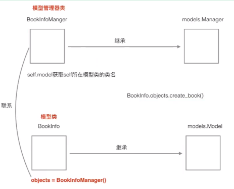
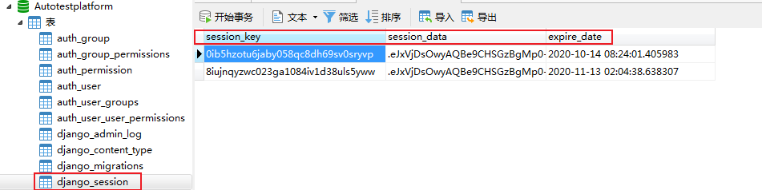

# Django入门

## 1、Djiango入门命令

### 1.1	创建项目

> ```python
> // 1.创建项目
> django-admin startproject 项目名
> ```

> > 
> >
> > ```
> > - 目录说明
> >   - manage.py：一个命令行工具，可以使你用多种方式对Django项目进行交互
> >   - 内层的目录：项目的真正的Python包
> >   - *_init* _.py：一个空文件，它告诉Python这个目录应该被看做一个Python包
> >   - settings.py：项目的配置
> >   - urls.py：项目的URL声明
> >   - wsgi.py：项目与WSGI兼容的Web服务器入口
> > ```

### 1.2	创建应用

> ```python
> // 1.创建应用
> python manage.py startapp booktest
> ```
>
> > 
> >
> > ```
> > - 目录说明
> > 	- admin.py：管理后台网站
> >   - *_init* _.py：一个空文件，它告诉Python这个目录应该被看做一个Python包
> >   - migrations：迁移文件包
> >   - models.py：与数据库进行交互的
> >   - tests.py：单元测试的
> >   - views.pt: 接收浏览器请求，进行处理，返回页面相关
> >   - urls.py: 应用的URL声明
> > ```

### 1.3	数据库配置

> ```
> // 1.配置成Mysql数据库,在settings.py文件中，通过DATABASES项进行数据库设置
> ```
>
> > ```python
> > # python3需要安装pymysql,且需要在'项目包'/__init__.py中加如下内容：import pymysql，pymysql.install_as_MySQLdb()
> > DATABASES = {
> >     'default': {
> >         'ENGINE': 'django.db.backends.mysql',
> >         'NAME': '数据库名',
> >         'USER': '用户',
> >         'PASSWORD': '密码',
> >         'HOST': '地址',
> >         'PORT': '端口',
> >     }
> > }
> > ```

### 1.4	定义模型类

> ```
> // 1.有一个数据表，就有一个模型类与之对应
> ```
>
> > ```python
> > from django.db import models
> > # models.py文件跟数据库操作相关
> > # 1.在models.py中定义模型类
> > # 2.迁移
> > # 3.通过类和对象完成数据增删改查操作
> > # 定义模型类
> > class BookInfo(models.Model):
> >     pass
> > ```

### 1.5	生成数据表

> ```python
> // 1.激活模型：编辑settings.py文件，将booktest应用加入到installed_apps中
> INSTALLED_APPS = [
>   'django.contrib.admin',
>   'django.contrib.auth',
>   'django.contrib.contenttypes',
>   'django.contrib.sessions',
>   'django.contrib.messages',
>   'django.contrib.staticfiles',
>   'booktest.apps.BooktestConfig',
> ]
> // 2.生成迁移文件：根据模型类生成sql语句
> python manage.py makemigrations
> // 3.执行迁移：执行sql语句生成数据表
> python manage.py migrate
> ```
>

### 1.6	定义视图

> ```
> // 1.应用包下views.py文件定义视图函数跟接收浏览器请求，进行处理，返回页面相关
> ```
>
> > ```python
> > // 举例如下
> > from django.shortcuts import render
> > from 应用包.models import *
> > # /index
> > def index(request):
> >     '''首页，展示所有图书'''
> >     # 查询所有图书
> >     booklist = BookInfo.objects.all()
> >     # 将图书列表传递到模板中，然后渲染模板
> >     context = {'booklist': booklist}
> >     return render(request, 'booktest/index.html', context)
> > ```
> >
> > 

### 1.7	配置Url

> ```python
>// 1.项目包/urls.py文件，配置url举例如下：
> from django.contrib import admin
> from django.conf.urls import url,include
> urlpatterns = [
>  url(r'^admin/', admin.site.urls),
>  # 引入booktest的url配置
>     url(r'^', include('booktest.urls'))
>    ]
>    
> // 2.在booktest应用下创建urls.py文件，代码如下：
> from django.conf.urls import url
> from booktest import views
> urlpatterns = [
>  url(r'^index/$', views.index),
>  url(r'^detail/(\d+)/$', views.detail),
>    ]
>    ```

### 1.8	创建模板

> 
>
> ```python
> // 1.打开项目包/settings.py文件，配置模板查找目录TEMPLATES的DIRS
> import os
> TEMPLATES = [
>     {
>         'BACKEND': 'django.template.backends.django.DjangoTemplates',
>         'DIRS': [os.path.join(BASE_DIR, 'templates')],
>         'APP_DIRS': True,
>         'OPTIONS': {
>             'context_processors': [
>                 'django.template.context_processors.debug',
>                 'django.template.context_processors.request',
>                 'django.contrib.auth.context_processors.auth',
>                 'django.contrib.messages.context_processors.messages',
>             ],
>         },
>     },
> ]
> 
> // 2.创建templates/booktest/回显的页面.html文件。
> {#在模板中输出变量语法如下，变量可能是从视图中传递过来的，也可能是在模板中定义的{{ 变量名 }}{ 代码段 }#}
> <!DOCTYPE html>
> <html lang="en">
> <head>
>     <meta charset="UTF-8">
>     <title>图书列表</title>
> </head>
> <body>
> <ul>
>     {#遍历图书列表#}
>     
>         <li>
>         {#输入图书名称并设置超链接，连接地址是一个数字#}
>         <a href="/detail/{{ book.id }}/">{{ book.btitle }}</a>
>         </li>
>     
> </ul>
> </body>
> </html>
> ```

### 1.9	启动服务器

> ```python
> // 1.启动调试服务器
> python manage.py runserver ip:port
> ```


## 2、模型

### 2.1	字段属性

> - Django根据属性的类型确定以下信息：
>
>   > - 当前选择的数据库支持字段的类型
>   > - 渲染管理表单时使用的默认html控件
>   > - 在管理站点最低限度的验证
>   >   django会为表创建自动增长的主键列，每个模型只能有一个主键列，如果使用选项设置某属性为主键列后django不会再创建自动增长的主键列。
>
> - 默认创建的主键列属性为id，可以使用pk代替，pk全拼为primary key。
>
>   > - 注意：pk是主键的别名，若主键名为id2，那么pk是id2的别名。
>
> - 属性命名限制：
>
>   > - 不能是python的保留关键字。
>   >
>   > - 不允许使用连续的下划线，这是由django的查询方式决定的。
>   >
>   > - 定义属性时需要指定字段类型，通过字段类型的参数指定选项，语法如下：
>   >
>   >   ```
>   >   属性=models.字段类型(选项)
>   >   ```
>

### 2.2	字段类型

> - 使用时需要引入django.db.models包，字段类型如下：
>
>   > - AutoField：自动增长的IntegerField，通常不用指定，不指定时Django会自动创建属性名为id的自动增长属性。
>   > - BooleanField：布尔字段，值为True或False。
>   > - NullBooleanField：支持Null、True、False三种值。
>   > - CharField(max_length=字符长度)：字符串。
>   >   - 参数max_length表示最大字符个数。
>   >
>   > - TextField：大文本字段，一般超过4000个字符时使用。
>   > - IntegerField：整数。
>   > - DecimalField(max_digits=None, decimal_places=None)：十进制浮点数。
>   >   - 参数max_digits表示总位数。
>   >   - 参数decimal_places表示小数位数。
>   >
>   > - FloatField：浮点数。
>   > - DateField[auto_now=False, auto_now_add=False])：日期。
>   >   - 参数auto_now表示每次保存对象时，自动设置该字段为当前时间，用于"最后一次修改"的时间戳，它总是使用当前日期，默认为false。
>   >   - 参数auto_now_add表示当对象第一次被创建时自动设置当前时间，用于创建的时间戳，它总是使用当前日期，默认为false。
>   >   - 参数auto_now_add和auto_now是相互排斥的，组合将会发生错误。
>   >
>   > - TimeField：时间，参数同DateField。
>   > - DateTimeField：日期时间，参数同DateField。
>   > - FileField：上传文件字段。
>   > - ImageField：继承于FileField，对上传的内容进行校验，确保是有效的图片。

### 2.3	字段选项

> - 通过选项实现对字段的约束，选项如下：
>
>   > - null：如果为True，表示数据库字段允许为空，默认值是False。
>   > - blank：如果为True，则后台管理该字段允许为空白，默认值是False。
>   >   - 对比：null是数据库范畴的概念，blank是表单验证范畴的**。
>   > - db_column：字段的名称，如果未指定，则使用属性的名称存入到数据库中。
>   > - db_index：若值为True, 则在数据库表中会为此字段创建索引，默认值是False。
>   > - default：设置字段属性类型的默认值
>   > - primary_key：若为True，则该字段会成为模型的主键字段，默认值是False，一般作为AutoField的选项使用。
>   > - unique：如果为True, 这个字段在数据库表中必须有唯一值，默认值是False。

### 2.4	字段查询

> - 通过模型类.objects属性可以调整如下函数，实现对模型类对应的数据表的查询。
>
>   > | 函数名     | 功能                                   | 返回值                 | 说明                                                         |
>   > | ---------- | -------------------------------------- | ---------------------- | ------------------------------------------------------------ |
>   > | get()      | 返回表中满足条件的一条且只能有一条数据 | 返回值是一个模型类对象 | 参数中写查询条件。<br />1. 如果查到多条数据，则抛出异常miltipleobjectsreturned<br />2.查询不到数据，则抛出doesnotexist |
>   > | all()      | 返回模型对应表格中的所有数据           | 返回值是queryset类型   | 查询集                                                       |
>   > | filter()   | 返回满足条件的数据                     | 返回值是queryset类型   | 参数写查询条件                                               |
>   > | exclude()  | 返回不满足条件的数据                   | 返回值是queryset类型   | 参数写查询条件                                               |
>   > | order_by() | 对查询结果进行排序                     | 返回值是queryset类型   | 参数中写根据那些字段进行排序                                 |
>
> - 条件查询：语法  属性名称__比较运算符=值
>
>   > - 查询等：exact
>   > - 模糊查询：contains
>   > - 以指定值开头或结尾：startswith、endswith
>   > - 空查询：isnull
>   > - 范围查询：in [] 接的是列表
>   > - 比较查询：gt、gte、lt、lte：大于、大于等于、小于、小于等于
>   > - 日期查询：year、month、day、week_day、hour、minute、second：对日期时间类型的属性进行运算
>
> - F对象：F(属性名)-用于对属性的比较
>
>   ```python
>   from django.db.models import F
>   ...
>   list = BookInfo.objects.filter(bread__gte=F('bcomment'))
>   ```
>   
> - Q对象：Q(属性名__运算符=值)，使用&、|、~表示。
>
>   ```python
>   list = BookInfo.objects.filter(Q(bread__gt=20) | Q(pk__lt=3))
>   
>   //Q对象前可以使用~操作符，表示非not。
>   
>   //例：查询编号不等于3的图书。
>   
>   list = BookInfo.objects.filter(~Q(pk=3))
>   ```
>   
> - 聚合函数：aggregate(Avg，Count，Max，Min，Sum)过滤器调用聚合函数
>
>   ```python
>   //注意aggregate的返回值是一个字典类型，格式如下：
>   
>   // {'聚合类小写__属性名':值}
>   // 如:{'sum__bread':3}
>       
>   //例：查询图书的总阅读量。
>   
>   from django.db.models import Sum
>   ...
>   list = BookInfo.objects.aggregate(Sum('bread'))
>   
>   //使用count时一般不使用aggregate()过滤器。
>   
>   //例：查询图书总数。
>   
>   list = BookInfo.objects.count()
>   //注意count函数的返回值是一个数字。
>   ```
>   
> - 关联查询：实现类似于join查询。
>
>   > 1. 通过对象执行关联查询
>   >
>   >    > - 由一到多的访问语法-访问多
>   >    >
>   >    >   ```python
>   >    >   // 1.一对应的模型类对象.多对应的模型类名小写_set
>   >    >   b = BookInfo.objects.get(id=1)
>   >    >   b.heroinfo_set.all()
>   >    >   ```
>   >    >
>   >    > -   由多到一的访问语法-访问一
>   >    >
>   >    >     ```python
>   >    >     // 1.多对应的模型类对象.多对应的模型类中的关系类属性名
>   >    >     h = HeroInfo.objects.get(id=1)
>   >    >     h.hbook
>   >    >     ```
>   >    >
>   >    > - 访问一对一的模型类关联对象的id语法:访问一
>   >    >
>   >    >   ```python
>   >    >   // 1.多对应的模型类对象.关联类属性_id
>   >    >   h = HeroInfo.objects.get(id=1)
>   >    >   h.book_id
>   >    >   ```
>   >
>   > 2. 通过模型类执行关联查询
>   >
>   >    > - 由多模型类条件查询一模型类数据:访问一
>   >    >
>   >    >   ```python
>   >    >   // 1.语法：关联模型类名小写__属性名__条件运算符=值如果没有"__运算符"部分，表示等于，结果和sql中的inner join相同。
>   >    >   
>   >    >   // 2.例：查询图书，要求图书中英雄的描述包含'八'。
>   >    >   
>   >    >   BookInfo.objects.filter(heroinfo__hcontent__contains='八')
>   >    >   ```
>   >    >
>   >    > - 由一模型类条件查询多模型类数据:访问多
>   >    >
>   >    >   ```python
>   >    >   // 1.语法：一模型类关联属性名__一模型类属性名__条件运算符=值
>   >    >   
>   >    >   // 2.例：查询书名为“天龙八部”的所有英雄。
>   >    >   
>   >    >   list = HeroInfo.objects.filter(hbook__btitle='天龙八部')
>   >    >   ```
>   >    >
>   >    >   
>
>   
>
> - 总结
>
>   > 1. get：返回一条且只有一条数据，返回值是一个对象，参数可以写查询条件。
>   > 2. all：返回模型对应表的所有数据，返回值是queryset
>   > 3. filter：返回满足条件的数据，返回值是queryset，参数可以写查询条件
>   > 4. exclude：返回不满足条件的数据，返回值是queryset，参数可以写查询条件
>   > 5. order_by：对查询结果进行排序，返回值是queryset，参数可以写查询条件
>   > 6. 导入的包 from django.db.models import F,Q,Sum,Count,Avg,Max,Min
>   > 7. F对象：用于类属性之间的比较。
>   > 8. Q对象：用于条件之间的逻辑关系。
>   > 9. aggregate：进行聚合操作，返回值是一个字典，进行聚合的时候需要先导入聚合类。
>   > 10. count：返回结果集中数据的数目，返回值是一个数字。
>   >
>   > > 备注：
>   > >
>   > > - 对一个queryset实例对象，可以继续调用上面的所有函数。
>   > >
>   > > - queryset询集特性：
>   > >
>   > >   1）惰性查询：只有在实际使用查询集中的数据的时候才会发生对数据库的真正查询。
>   > >
>   > >   2）缓存：当使用的是同一个查询集时，第一次使用的时候会发生实际数据库的查询，然后把结果缓存起来，之后再使用这个查询集时，使用的是缓存中的。
>   > >
>   > >   3）可以用角标或者切片的方式来限制查询值。
>   > >
>   > >   - 可以对查询集进行取下标或切片操作，等同于sql中的limit和offset子句。
>   > >
>   > >     > 注意：不支持负数索引。对查询集进行切片后返回一个新的查询集，不会立即执行查询。如果获取一个对象，直接使用[0]，等同于[0:1].get()，但是如果没有数据，[0]引发IndexError异常，[0:1].get()如果没有数据引发DoesNotExist异常。

### 2.5	模型类关系

> - 关系数据类型
>
>   > 1. 关系型数据库的关系包括三种类型
>   >
>   >    > - ForeignKey：一对多，将字段定义在多的一端中。
>   >    > - ManyToManyField：多对多，将字段定义在任意一端中。
>   >    > - OneToOneField：一对一，将字段定义在任意一端中。
>   >    > - 可以维护递归的关联关系，使用'self'指定，详见"自关联"。
>   >
>   > 2. 一对多
>   >
>   >    > ```python
>   >    > // 1.英雄与图书表的关系为一对多，所以属性定义在英雄模型类中
>   >    > hbook = models.ForeignKey('BookInfo')
>   >    > ```
>   >
>   > 3. 多对多
>   >
>   >    > ```python
>   >    > // 1.通过ManyToManyField建立TypeInfo类和NewsInfo类之间多对多的关系
>   >    > ntype = models.ManyToManyField('TypeInfo') 
>   >    > ```
>   >
>   > 4. 一对一
>   >
>   >    > ```python
>   >    > // 1.通过OneToOneField建立TypeInfo类和NewsInfo类之间一对一的关系
>   >    > ntype = models.OneToOneField('TypeInfo') 
>   >    > ```
>   >
>   > 5. 自关联
>   >
>   >    > ```python
>   >    > // 1.关系属性使用self指向本类，一般要求null和blank允许为空
>   >    > aParent=models.ForeignKey('self',null=True,blank=True)
>   >    > ```
>   >
>
> - 管理器models.Manager
>
>   > 1. objects与models.Manager
>   >
>   >    > ```python
>   >    > // 1.属性objects：管理器，是models.Manager类型的对象，用于与数据库进行交互
>   >    > 
>   >    > // 2.当没有为模型类定义管理器时，Django会为每一个模型类生成一个名为objects的管理器，自定义管理器后，Django不再生成默认管理器objects
>   >    > 
>   >    > // 3.自定义管理器类主要用于两种情况：1).修改原始查询集，重写all()方法2)向管理器类中添加额外的方法，如向数据库中插入数据
>   >    > 
>   >    > // 修改原始查询集，重写all()方法
>   >    > class BookInfoManager(models.Manager):
>   >    >     def all(self):
>   >    >         #默认查询未删除的图书信息
>   >    >         #调用父类的成员语法为：super().方法名
>   >    >         return super().all().filter(isDelete=False)
>   >    >       
>   >    > class BookInfo(models.Model):
>   >    >     ...
>   >    >     objects = BookInfoManager()
>   >    >     
>   >    > book=BookInfo.objects.all()
>   >    >       
>   >    > // 向管理器类中添加额外的方法，如向数据库中插入数据
>   >    > class BookInfoManager(models.Manager):
>   >    >     ...
>   >    >     #创建模型类，接收参数为属性赋值
>   >    >     def create_book(self, title, pub_date):
>   >    >         #创建模型类对象self.model可以获得模型类
>   >    >         book = self.model()
>   >    >         book.btitle = title
>   >    >         book.bpub_date = pub_date
>   >    >         book.bread=0
>   >    >         book.bcommet=0
>   >    >         book.isDelete = False
>   >    >         # 将数据插入进数据表
>   >    >         book.save()
>   >    >         return book
>   >    >  
>   >    > class BookInfo(models.Model):
>   >    >     ...
>   >    >     objects = BookInfoManager()
>   >    >     
>   >    > book=BookInfo.objects.create_book("abc",date(1980,1,1))
>   >    > ```
>   >
>   > 2. 总结
>   >
>   >    > 
>   
> - 元选项
>
>   >  ```python
>   > // 1.在模型类中定义类Meta，用于设置元信息，如使用db_table自定义表的名字。数据表的默认名称为：<app_name>_<model_name>例：booktest_bookinfo
>   > 
>   > // 2.例：指定BookInfo模型类生成的数据表名为bookinfo。
>   > #定义图书模型类BookInfo
>   > class BookInfo(models.Model):
>   >     ...
>   > 
>   >     #定义元选项
>   >     class Meta:
>   >       db_table='bookinfo' #指定BookInfo生成的数据表名为bookinfo
>   >  ```

## 3、视图

### 3.1	视图

> 1. 视图的功能
>
>    > - 接受请求，进行处理，与M和T进行交互，返回应答。
>    > - 返回html内容HttpResponse，也可能重定向redirect，还可能使JsonResponse
>    > - 用户通过在浏览器的地址栏中输入网址请求网站，对于Django开发的网站，由哪一个视图进行处理请求，是由url匹配找到的。
>
> 2. url获取值
>
>    > - 位置参数
>    >
>    >   ```python
>    >   // 1.直接使用小括号，通过位置参数传递给视图。
>    >   url(r'^delete(\d+)/$',views.show_arg),
>    >   
>    >   // 2.修改视图show_arg
>    >   def show_arg(request,id):
>    >       return HttpResponse('show arg %s'%id)
>    >   ```
>    >
>    > - 关键字参数
>    >
>    >   ```python
>    >   // 1.修改正则表达式如下，其中?P部分表示为这个参数定义的名称为id，可以是其它名称，起名做到见名知意。
>    >   url(r'^delete(?P<id>\d+)/$',views.show_arg),
>    >   
>    >   // 2.修改视图show_arg，注意：视图show_arg此时必须要有一个参数名为id1，否则报错。
>    >   def show_arg(request,id1):
>    >       return HttpResponse('show %s'%id1)
>    >   ```
>
> 3. 内置错误视图
>
>    > - Django内置处理HTTP错误的视图，主要错误及视图包括：
>    >   - 404错误：page not found视图
>    >   - 500错误：server error视图
>    >
>    > - 如果想看到错误视图而不是调试信息，需要修改test3/setting.py文件的DEBUG项。
>    >
>    >   ```python
>    >   DEBUG = False
>    >   ALLOWED_HOSTS = ['*', ]
>    >   ```

## 4、模板

## 5、HttpReqeust对象

### 5.1	定义

> - 服务器接收到http协议的请求后，会根据报文创建HttpRequest对象，这个对象不需要我们创建，直接使用服务器构造好的对象就可以。视图的第一个参数必须是HttpRequest对象，在django.http模块中定义了HttpRequest对象的API。

### 5.2	属性

> - path：一个字符串，表示请求的页面的完整路径，不包含域名和参数部分。
>
>   ```python
>   // 1.打开booktest/views.py文件，代码如下：
>   
>   def index(request):
>       str='%s'%(request.path)
>       return render(request, 'booktest/index.html', {'str':str})
>   ```
>
> - method：一个字符串，表示请求使用的HTTP方法，常用值包括：'GET'、'POST'。
>
>   > - 在浏览器中给出地址发出请求采用get方式，如超链接。
>   > - 在浏览器中点击表单的提交按钮发起请求，如果表单的method设置为post则为post请求。
>
> - encoding：一个字符串，表示提交的数据的编码方式。
>
>   > - 如果为None则表示使用浏览器的默认设置，一般为utf-8。
>   >
>   > - 这个属性是可写的，可以通过修改它来修改访问表单数据使用的编码，接下来对属性的任何访问将使用新的encoding值。
>   >
>   >   > ```python
>   >   > // 1.打开booktest/views.py文件，代码如下：
>   >   > 
>   >   > def index(request):
>   >   >     str='%s'%(request.encoding)
>   >   >     return render(request, 'booktest/index.html', {'str':str})
>   >   > ```
>
> - GET：QueryDict类型对象，类似于字典，包含get请求方式的所有参数。
>
>   > ```python
>   > <a href="/show_reqarg/?a=1&b=2&c=python">get方式提交数据</a><br/>
>   > ```
>
> - POST：QueryDict类型对象，类似于字典，包含post请求方式的所有参数。
>
>   > 1）使用form表单请求时，method方式为post则会发起post方式的请求，需要使用HttpRequest对象的POST属性接收参数，POST属性是一个QueryDict类型的对象。
>   >
>   > ​		问：表单form如何提交参数呢？
>   >
>   > ​		答：表单控件name属性的值作为键，value属性的值为值，构成键值对提交。
>   >
>   > > - 如果表单控件没有name属性则不提交。
>   > >
>   > > - 对于checkbox控件，name属性的值相同为一组，被选中的项会被提交，出现一键多值的情况。
>   > >
>   > > - 键是表单控件name属性的值，是由开发人员编写的。
>   > >
>   > > - 值是用户填写或选择的。
>   > >
>   > >   ```python
>   > >   // 1.post提交方式示例
>   > >   <form method="post" action="/show_reqarg/">
>   > >       姓名：<input type="text" name="uname"><br/>
>   > >       性别：男<input type="radio" name="gender" value="男"/>
>   > >       女<input type="radio" name="gender" value="女"/><br/>
>   > >       爱好：
>   > >       吃饭<input type="checkbox" name="hobby" value="吃饭"/>
>   > >       睡觉<input type="checkbox" name="hobby" value="睡觉"/>
>   > >       打豆豆<input type="checkbox" name="hobby" value="打豆豆"/><br>
>   > >       <input type="submit" value="提交">
>   > >   </form>
>   > >   ```
>
> - FILES：一个类似于字典的对象，包含所有的上传文件。
>
> - COOKIES：一个标准的Python字典，包含所有的cookie，键和值都为字符串。
>
> - session：一个既可读又可写的类似于字典的对象，表示当前的会话，只有当Django 启用会话的支持时才可用，详细内容见"状态保持"。

### 5.3	QueryDict对象

> - 定义在django.http.QueryDict
>
> - HttpRequest对象的属性GET、POST都是QueryDict类型的对象
>
> - 与python字典不同，QueryDict类型的对象用来处理同一个键带有多个值的情况
>
> - 方法get()：根据键获取值，键和值都是字符串类型
>
> - 如果一个键同时拥有多个值将获取最后一个值
>
> - 如果键不存在则返回None值，可以设置默认值进行后续处理
>
>   > ````python
>   > dict.get('键',默认值)
>   > 可简写为
>   > dict['键']
>   > ````
>
> - 方法getlist()：根据键获取值，值以列表返回，可以获取指定键的所有值
>
> - 如果键不存在则返回空列表[]，可以设置默认值进行后续处理
>
>   > ```python
>   > dict.getlist('键',默认值)
>   > ```
>

## 6、HttpResponse对象

### 6.1	定义

> - 视图在接收请求并处理后，必须返回HttpResponse对象或子对象。在django.http模块中定义了HttpResponse对象的API。HttpRequest对象由Django创建，HttpResponse对象由开发人员创建。

### 6.2	属性

> - content：表示返回的内容。
> - charset：表示response采用的编码字符集，默认为utf-8。
> - status_code：返回的HTTP响应状态码。
> - content-type：指定返回数据的的MIME类型，默认为'text/html'。

### 6.3	方法

> - _init_：创建HttpResponse对象后完成返回内容的初始化。
>
> - set_cookie：设置Cookie信息。
>
>   > ```python
>   > set_cookie(key, value='', max_age=None, expires=None)
>   > ```
>
> - cookie是网站以键值对格式存储在浏览器中的一段纯文本信息，用于实现用户跟踪。
>
>   > - max_age是一个整数，表示在指定秒数后过期。
>   > - expires是一个datetime或timedelta对象，会话将在这个指定的日期/时间过期。
>   > - max_age与expires二选一。
>   > - 如果不指定过期时间，在关闭浏览器时cookie会过期。
>
> - delete_cookie(key)：删除指定的key的Cookie，如果key不存在则什么也不发生。
>
> - write：向响应体中写数据。
>
> - 调用模板简写函数render
>
>   每次调用模板时都要执行加载、上下文、渲染三个步骤，为了简化操作，Django定义了render()函数封装了以上三个步骤的代码，定义在django.shortcuts模块中。
>
>   1）打开booktest/views.py文件，定义视图index3如下：
>
>   > ```python
>   > from django.shortcuts import render
>   > ...
>   > def index3(request):
>   >     return render(request, 'booktest/index3.html', {'h1': 'hello'})
>   > ```

### 6.4	子类JsonResponse

> - 在浏览器中使用javascript发起ajax请求时，返回json格式的数据，此处以jquery的get()方法为例。类JsonResponse继承自HttpResponse对象，被定义在django.http模块中，创建对象时接收字典作为参数。
>
>   > - JsonResponse对象的content-type为'application/json'

### 6.5	子类HttpResponseRedirect

> - 当一个逻辑处理完成后，不需要向客户端呈现数据，而是转回到其它页面，如添加成功、修改成功、删除成功后显示数据列表，而数据的列表视图已经开发完成，此时不需要重新编写列表的代码，而是转到这个视图就可以，此时就需要模拟一个用户请求的效果，从一个视图转到另外一个视图，就称为重定向。
>
>   > Django中提供了HttpResponseRedirect对象实现重定向功能，这个类继承自HttpResponse，被定义在django.http模块中，返回的状态码为302。
>
> - 在django.shortcuts模块中为重定向类提供了简写函数redirect。
>
>   ```python
>   from django.shortcuts import redirect
>   ...
>   def red1(request):
>       return redirect('/')
>   ```

## 7、Cookie和Session

### 7.1	Cookie

> 1. 典型应用：记住用户名，网站的广告推送。
>
> 2. 设置Cookie
>
>    > ```python
>    > // 1.set_cookie前需要获得一个response对象
>    > response.set_cookie('h1', '你好')读取Cookie
>    > ```
>    
> 3. 读取Cookie
>
>    > ```python
>    > request.COOKIES['h1']
>    > ```
>
> 4. 方法
>
>    > ```python
>    > set_cookie(key, value='', max_age=None, expires=None)
>    > ```

### 7.2	Session

> 1. 对于敏感、重要的信息，建议要储在服务器端，不能存储在浏览器中，如用户名、余额、等级、验证码等信息。
>
>    > 在服务器端进行状态保持的方案就是Session。
>
> 2.  启用Session
>
>     > 1.Django项目默认启用Session。
>     >
>     > 2.打开test3/settings.py文件，在项MIDDLEWARE_CLASSES中启用Session中间件。
>
> 3. 存储方式
>
>    > 打开test3/settings.py文件，设置SESSION_ENGINE项指定Session数据存储的方式，可以存储在数据库、缓存、Redis等。
>    >
>    > 1）存储在数据库中，如下设置可以写，也可以不写，这是默认存储方式。
>    >
>    > ```python
>    >   SESSION_ENGINE='django.contrib.sessions.backends.db'
>    > ```
>    >
>    > 2）存储在缓存中：存储在本机内存中，如果丢失则不能找回，比数据库的方式读写更快。
>    >
>    > ```python
>    > SESSION_ENGINE='django.contrib.sessions.backends.cache'
>    > ```
>    >
>    > 3）混合存储：优先从本机内存中存取，如果没有则从数据库中存取。
>    >
>    > ```python
>    > SESSION_ENGINE='django.contrib.sessions.backends.cached_db'
>    > ```
>    >
>    > 4）Redis存储：pip install django-redis-sessions==0.5.6，修改test3/settings文件，增加如下项：
>    >
>    > ```python
>    > SESSION_ENGINE = 'redis_sessions.session'SESSION_ENGINE = 'redis_sessions.session'
>    > SESSION_REDIS_HOST = 'localhost'
>    > SESSION_REDIS_PORT = 6379
>    > SESSION_REDIS_DB = 2
>    > SESSION_REDIS_PASSWORD = ''
>    > SESSION_REDIS_PREFIX = 'session'
>    > ```
>    >
>    > 
>    >
>    > 5）如果存储在数据库中，需要在项INSTALLED_APPS中安装Session应用。
>    >
>    > ```python
>    > INSTALLED_APPS = [
>    >  'django.contrib.admin',
>    >  'django.contrib.auth',
>    >  'django.contrib.contenttypes',
>    >  'django.contrib.sessions',
>    >  # 注销掉则自动登录会失效 服务器第一次响应浏览器请求时，会生成一个sessionid，返回给浏览器，浏览器再次请求时，会带上cookie中的sessionid,服务器通过查询sessionid，在 数据库中查询是哪个用户，取出信息，返回给浏览器，django就是通过cookie和session机制完成了自动登录
>    >  'django.contrib.messages',
>    >  'django.contrib.staticfiles',
>    >  'apitest',
>    > ]
>    > ```
>
> 4. 依赖于Cookie
>
>    >1）所有请求者的Session都会存储在服务器中，服务器如何区分请求者和Session数据的对应关系呢？
>    >
>    >>  答：在使用Session后，会在Cookie中存储一个sessionid的数据，每次请求时浏览器都会将这个数据发给服务器，服务器在接收到sessionid后，会根据这个值找出这个请求者的Session。
>    >>
>    >> >  结果：如果想使用Session，浏览器必须支持Cookie，否则就无法使用Session了。
>    >
>    >2）存储Sesion时，键与Cookie中的sessionid相同，值是开发人员设置的键值对信息，进行了base64编码，过期时间由开发人员设置。
>
> 5. 对象及方法
>
>    > 通过HttpRequest对象的session属性进行会话的读写操作。
>    >
>    > 1） 以键值对的格式写session。
>    >
>    > ```python
>    > request.session['键']=值
>    > //解码session_data网址：https://tool.oschina.net/encrypt?type=3
>    > ```
>    >
>    > > 
>    >
>    > 2）根据键读取值。
>    >
>    > ```python
>    > request.session.get('键',默认值)
>    > ```
>    >
>    > 3）清除所有session，在存储中删除值部分。
>    >
>    > ```python
>    > request.session.clear()
>    > ```
>    >
>    > 4）清除session数据，在存储中删除session的整条数据。
>    >
>    > ```python
>    > request.session.flush()
>    > ```
>    >
>    > 5）删除session中的指定键及值，在存储中只删除某个键及对应的值。
>    >
>    > ```python
>    > del request.session['键']
>    > ```
>    >
>    > 6）设置会话的超时时间，如果没有指定过期时间则两个星期后过期。
>    >
>    > ```
>    > request.session.set_expiry(value)
>    > ```
>    >
>    > - 如果value是一个整数，会话将在value秒没有活动后过期。
>    > - 如果value为0，那么用户会话的Cookie将在用户的浏览器关闭时过期。
>    > - 如果value为None，那么会话永不过期。

## 8、用户认证auth模块

### 8.1	介绍

> - 基本上在任何网站上，都无可避免的需要设计实现网站的用户系统。此时我们需要实现包括用户注册、用户登录、用户认证、注销、修改密码等功能。使用Django，我们可以不需要自己写这些功能，因为Django内置了强大的用户认证系统--auth，它默认使用 auth_user 表来存储用户数据。
>
>   > ```python
>   > // 1.使用auth认证系统from
>   > from django.contrib import auth  
>   > 
>   > // 2.auth认证系统默认使用User表
>   > from django.contrib.auth.models import User  
>   > 
>   > // 3.注意：命令行创建超级用户 python manage.py createsuperuser
>   > ```

### 8.2	authenticate() 

> - 提供了用户认证功能，即验证用户名以及密码是否正确，一般需要username 、password两个关键字参数。
>   
> - 如果认证成功（用户名和密码正确有效），便会返回一个 User 对象。
>   
> - authenticate()会在该 User 对象上设置一个属性(id)来标识后端已经认证了该用户，且该信息在后续的登录过程中是需要的。
>   
>   > ```python
>   > // 1.用法：
>   > from django.contrib import auth
>   > user_obj = auth.authenticate(username=username,password=pwd)
>   > ```
>

### 8.3	login(request, user)

> - 该函数接受一个HttpRequest对象，以及一个经过认证的User对象。
>   
> - 该函数实现一个用户登录的功能。它本质上会在后端为该用户生成相关session数据。
>   
>   >  ```python
>   > // 1.用法：auth.login(request, user_obj)
>   > // 2.示例：
>   > from django.shortcuts import render, HttpResponse, redirect
>   > from django.contrib import auth
>   > 
>   > def login(request):
>   >         if request.method == "POST":
>   >             username = request.POST.get('username')
>   >             pwd = request.POST.get('password')
>   >             # 调用auth模块的认证方法，判断用户名和密码是否正确，正确返回一个user_obj
>   >             user_obj = auth.authenticate(username=username, password=pwd)
>   >             if user_obj:
>   >                 # 登录成功,设置Session数据
>   >                 auth.login(request, user_obj)
>   >                 return HttpResponse('登录成功')
>   >             else:
>   >                 return render(request, 'login.html', {'error_msg': '用户名或者密码错误'})
>   >         return render(request, 'login.html')
>   > 
>   > // 3.注意：
>   > 		#只要使用login(request, user_obj)之后，request.user就能拿到当前登录的用户对象。否则request.user得到的是一个匿名用户对象（AnonymousUser Object）。详细原理请查看 AuthenticationMiddleware 中间件源码。
>   >  ```

### 8.4	logout(request)

> - 该函数接受一个HttpRequest对象，无返回值。当调用该函数时，当前请求的session信息会全部清除。该用户即使没有登录，使用该函数也不会报错。
>
>   > ```python
>   > / 1.用法：
>   > 
>   > from django.contrib import auth
>   > from django.shortcuts import redirect
>   > 
>   > def logout(request):
>   >     auth.logout(request)
>   >     return redirect('/login/')
>   > ```

### 8.5	login_requierd()

> - auth 给我们提供的一个装饰器工具，用来快捷的给某个视图添加登录校验。
>
>   > ```python
>   > // 1.用法：
>   > from django.contrib.auth.decorators import login_required
>   > 
>   > @login_required
>   > def index(request):
>   >  		return render(request, 'index.html')
>   > ```
>
> - 若用户没有登录，则会跳转到django默认的登录URL '/accounts/login/ ' 并传递当前访问url的绝对路径 (登陆成功后，会重定向到该路径)。如果需要自定义登录的URL，则需要在settings.py文件中通过LOGIN_URL进行修改。
>
>   > ```python
>   > // 1.示例：
>   > LOGIN_URL = '/login/'  # 这里配置成你项目登录页面的路由
>   > ```

### 8.6	create_user()

> - 
>   auth 提供的一个创建新用户的方法，需要提供必要参数（username、password）等。
>   
>   > ```python
>   > // 1.用法：
>   > from django.contrib.auth.models import User
>   > user = User.objects.create_user（username='用户名',password='密码',email='邮箱',...）
>   > 
>   > // 2.示例：
>   > def reg(request):
>   >     if request.method == 'POST':
>   >         username = request.POST.get('username')
>   >         pwd = request.POST.get('password')
>   >         # 假设数据都经过有效性校验了去数据库创建一条记录
>   > 				User.objects.create_user(username=username, password=pwd)  
>   > 				# create_user创建普通用户
>   >    		  return redirect('/login/')
>   >     return render(request, 'reg.html')
>   >    ```
> 

### 8.7	create_superuser()

> - auth 提供的一个创建新的超级用户的方法，需要提供必要参数（username、password）等。
> 
>   > ```python
>   > // 1.用法：
>   > from django.contrib.auth.models import User
>   > user_obj = User.objects.create_superuser（username='用户名',password='密码',email='邮箱',...）
>   > ```

### 8.8	check_password(raw_password)

> - auth 提供的一个检查密码是否正确的方法，需要提供当前请求用户的密码。
>   密码正确返回True，否则返回False。
>   
>   > ```python
>   > // 1.用法：
>   > ok = user_obj.check_password('密码')
>   > # 或者直接针对当前请求的user对象校验原密码是否正确：
>   > ok = request.user.check_password(raw_password='原密码')
>   > ```

### 8.9	set_password(raw_password)

> - auth 提供的一个修改密码的方法，接收要设置的新密码 作为参数。
>
> - 注意：设置完一定要调用用户对象的save方法！！！
>
>   > ```python
>   > // 1.用法：
>   > user_obj.set_password('新密码')
>   > user_obj.save()
>   > ```

### 8.10	is_authenticated()

> - 用来判断当前请求是否通过了认证。
>   
>   > ```python
>   > // 1.用法：
>   > 
>   > def my_view(request):
>   >   if not request.user.is_authenticated():
>   >     return redirect('%s?next=%s' % (settings.LOGIN_URL, request.path))
>   > ```

### 8.11	用户对象的属性

> - 从user_obj = request.user可以拿到当前登录的用户对象，用户对象user_obj能够拿到认证所用用户表的数据属性，比如username， password等。
>   
> - 其他常用属性含义如下：
>   is_staff ： 用户是否拥有网站的管理权限.
>   
>   is_active ： 是否允许用户登录, 设置为 False，可以在不删除用户的前提下禁止用户登录。

### 8.12	如何拓展auth默认的表

> - 1、介绍
>   
>   > 1）虽然内置的认证系统很 好用，但是auth_user表字段都是固定的那几个，如果我想要加一个存储用户手机号的字段怎么办？
>   >
>   > > - 方法一：新建另外一张表然后通过一对一和内置的auth_user表关联
>   > > - 方法二：通过继承内置的AbstractUser类，来定义一个自己的Model类。
>   > > - 这样既能根据项目需求灵活的设计用户表，又能使用Django强大的认证系统了。 
>   
> - 2、示例：
>   
>   > ```python
>   > // # models.py
>   > from django.db import models
>   > from django.contrib.auth.models import AbstractUser
>   > 
>   > class UserInfo(AbstractUser):这里定拓展的字段
>   >       gender = models.PositiveIntegerField(choices=((0, '女'),(1, '男'), (2, '保密')))
>   >       phone = models.CharField(max_length=11)
>   > ```
>
> - 3、注意：
>
>   > 1）按上面的方式扩展了内置的 auth_user表之后，一定要在settings.py中告诉Django，我现在使用我新定义的UserInfo表来做用户认证。写法如下：
>   >
>   > - 引用Django自带的User表，继承使用时需要设置
>   >
>   > - AUTH_USER_MODEL = "app名.UserInfo"
>
> - 4、自定义认证系统默认使用的数据表之后，我们就可以像使用默认的auth_user表那样使用我们的UserInfo表了。比如：
>
>   > ```python
>   > // 1.创建普通用户：
>   > UserInfo.objects.create_user(username='用户名', password='密码')
>   > 
>   > // 2.创建超级用户：
>   > UserInfo.objects.create_superuser(username='用户名', password='密码')
>   > ```
>
> - 5、再次注意：
>
>   > 1）一旦我们指定了新的认证系统所使用的表，我们就需要重新在数据库中创建该表，而不能继续使用原来默认的auth_user表了。
>   > 2）默认的auth_user表就会被你自定义的表替代，即auth_user表不存在了，我们使用auth模块的方法，修改的就是新的表。
>   > 3）继承AbstractUser是在User表的基础上拓展字段，User表原来的字段还是有的，但是如果我就不想要User表的某些字段，而且还要拓展我需要的字段呢？怎么办？就需要继承AbstractBaseUser, PermissionsMixin重写一个表，表内的字段完全是你设计的字段
>
> - 6、代码变现
>
>   > ```python
>   > from django.contrib.auth.models import AbstractBaseUser, PermissionsMixin, BaseUserManager
>   > 
>   > # 定义UserProfile这个类的管理类
>   > class UserManager(BaseUserManager):
>   >     use_in_migrations = True
>   > 
>   >     def _create_user(self, email, password, **extra_fields):
>   >         """
>   >         Creates and saves a User with the given email and password.
>   >         """
>   >         if not email:
>   >             raise ValueError('The given email must be set')
>   >         email = self.normalize_email(email)
>   >         user = self.model(email=email, **extra_fields)  # 创建对象
>   >         user.set_password(password)  # 把密码加密之后再写入数据库
>   >         user.save(using=self._db)  # 保存到数据库
>   >         return user
>   > 
>   >     def create_user(self, email, password=None, **extra_fields):
>   >         extra_fields.setdefault('is_staff', False)  # 给字典设置默认值
>   >         extra_fields.setdefault('is_superuser', False)
>   >         return self._create_user(email, password, **extra_fields)
>   > 
>   >     def create_superuser(self, email, password, **extra_fields):
>   >         extra_fields.setdefault('is_staff', True)
>   >         extra_fields.setdefault('is_superuser', True)
>   > 
>   >         if extra_fields.get('is_staff') is not True:
>   >             raise ValueError('Superuser must have is_staff=True.')
>   >         if extra_fields.get('is_superuser') is not True:
>   >             raise ValueError('Superuser must have is_superuser=True.')
>   >         return self._create_user(email, password, **extra_fields)
>   > 
>   > class UserProfile(AbstractBaseUser, PermissionsMixin):
>   >     email = models.EmailField(
>   >         max_length=255,
>   >         unique=True,
>   >         validators=[RegexValidator(r'^[a-zA-Z0-9_.-]+@[a-zA-Z0-9-]+(\.[a-zA-Z0-9-]+)*\.[a-zA-Z0-9]{2,6}$', '邮箱格式不正确'),]
>   >     )
>   >     is_staff = models.BooleanField(
>   >         _('staff status'),
>   >         default=False,
>   >         help_text=_('Designates whether the user can log into this admin site.'),
>   >     )
>   >     is_active = models.BooleanField(
>   >         _('active'),
>   >         default=True,
>   >         help_text=_(
>   >             'Designates whether this user should be treated as active. '
>   >             'Unselect this instead of deleting accounts.'
>   >         ),
>   >     )
>   >     name = models.CharField('名字', max_length=32)
>   >     department = models.ForeignKey('Department', default=None, blank=True, null=True)
>   >     mobile = models.CharField(
>   >         '手机',
>   >         max_length=32,
>   >         default=None,
>   >         blank=True,
>   >         null=True,
>   >         validators=[RegexValidator(r'^1[3-9]\d{9}$', '手机格式不正确')]
>   >     )
>   > 
>   >     memo = models.TextField('备注', blank=True, null=True, default=None)
>   >     date_joined = models.DateTimeField(auto_now_add=True)
>   > 
>   >     EMAIL_FIELD = 'email'  # 发送邮件的字段
>   >     USERNAME_FIELD = 'email'  # 用来唯一确定auth中的用户
>   >     REQUIRED_FIELDS = ['name']  # auth指定除了上面两个配置项的字段还有哪些字段需要必填
>   > 
>   >     class Meta:
>   >         verbose_name = '账户信息'
>   >         verbose_name_plural = "账户信息"
>   > 
>   >     def clean(self):
>   >         super(UserProfile, self).clean()
>   >         # 对邮件进行校验
>   >         self.email = self.__class__.objects.normalize_email(self.email)
>   > 
>   >     def get_full_name(self):
>   >         # The user is identified by their email address
>   >         return self.name
>   > 
>   >     def get_short_name(self):
>   >         # The user is identified by their email address
>   >         return self.email
>   > 
>   >     def __str__(self):  # __unicode__ on Python 2
>   >         return self.name
>   > 
>   >     # 给ORM添加管理类
>   >     objects = UserManager()
>   > ```

### 8.13	修改密码示例

> ```python
> @login_required
> def set_password(request):
>     user = request.user
>     err_msg = ''
>     if request.method == 'POST':
>         old_password = request.POST.get('old_password')
>         new_password = request.POST.get('new_password')
>         re_password = request.POST.get('re_password')
>         # 检查旧密码是否正确
>         if user.check_password(old_password):
>             if not new_password:
>                 err_msg = '新密码不能为空'
>             elif new_password != re_password:
>                 err_msg = '两次密码不一致'
>             else:
>                 user.set_password(new_password)
>                 user.save()
>                 return redirect("/login/")
>         else:
>             err_msg = '原密码输入错误'
>     return render(request, 'set_password.html', {'err_msg': err_msg})
> ```


