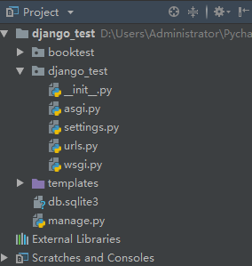
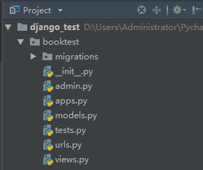

# Django入门

## 1、Djiango入门命令

### 1.1	创建项目

> ```python
> // 1.创建项目
> django-admin startproject 项目名
> ```

> > 
> >
> > ```
> > - 目录说明
> >   - manage.py：一个命令行工具，可以使你用多种方式对Django项目进行交互
> >   - 内层的目录：项目的真正的Python包
> >   - *_init* _.py：一个空文件，它告诉Python这个目录应该被看做一个Python包
> >   - settings.py：项目的配置
> >   - urls.py：项目的URL声明
> >   - wsgi.py：项目与WSGI兼容的Web服务器入口
> > ```

### 1.2	创建应用

> ```python
> // 1.创建应用
> python manage.py startapp booktest
> ```
>
> > 
> >
> > ```
> > - 目录说明
> > 	- admin.py：管理后台网站
> >   - *_init* _.py：一个空文件，它告诉Python这个目录应该被看做一个Python包
> >   - migrations：迁移文件包
> >   - models.py：与数据库进行交互的
> >   - tests.py：单元测试的
> >   - views.pt: 接收浏览器请求，进行处理，返回页面相关
> >   - urls.py: 应用的URL声明
> > ```

### 1.3	数据库配置

> ```
> // 1.配置成Mysql数据库,在settings.py文件中，通过DATABASES项进行数据库设置
> ```
>
> > ```python
> > # python3需要安装pymysql,且需要在'项目包'/__init__.py中加如下内容：import pymysql，pymysql.install_as_MySQLdb()
> > DATABASES = {
> >     'default': {
> >         'ENGINE': 'django.db.backends.mysql',
> >         'NAME': '数据库名',
> >         'USER': '用户',
> >         'PASSWORD': '密码',
> >         'HOST': '地址',
> >         'PORT': '端口',
> >     }
> > }
> > ```

### 1.4	定义模型类

> ```
> // 1.有一个数据表，就有一个模型类与之对应
> ```
>
> > ```python
> > from django.db import models
> > # models.py文件跟数据库操作相关
> > # 1.在models.py中定义模型类
> > # 2.迁移
> > # 3.通过类和对象完成数据增删改查操作
> > # 定义模型类
> > class BookInfo(models.Model):
> >     pass
> > ```

### 1.5	生成数据表

> ```python
> // 1.激活模型：编辑settings.py文件，将booktest应用加入到installed_apps中
> INSTALLED_APPS = [
>   'django.contrib.admin',
>   'django.contrib.auth',
>   'django.contrib.contenttypes',
>   'django.contrib.sessions',
>   'django.contrib.messages',
>   'django.contrib.staticfiles',
>   'booktest.apps.BooktestConfig',
> ]
> // 2.生成迁移文件：根据模型类生成sql语句
> python manage.py makemigrations
> // 3.执行迁移：执行sql语句生成数据表
> python manage.py migrate
> ```
>

### 1.6	定义视图

> ```
> // 1.应用包下views.py文件定义视图函数跟接收浏览器请求，进行处理，返回页面相关
> ```
>
> > ```python
> > // 举例如下
> > from django.shortcuts import render
> > from 应用包.models import *
> > # /index
> > def index(request):
> >     '''首页，展示所有图书'''
> >     # 查询所有图书
> >     booklist = BookInfo.objects.all()
> >     # 将图书列表传递到模板中，然后渲染模板
> >     context = {'booklist': booklist}
> >     return render(request, 'booktest/index.html', context)
> > ```
> >
> > 

### 1.7	配置Url

> ```python
>// 1.项目包/urls.py文件，配置url举例如下：
> from django.contrib import admin
> from django.conf.urls import url,include
> urlpatterns = [
>  url(r'^admin/', admin.site.urls),
>  # 引入booktest的url配置
>     url(r'^', include('booktest.urls'))
>    ]
>    
> // 2.在booktest应用下创建urls.py文件，代码如下：
> from django.conf.urls import url
> from booktest import views
> urlpatterns = [
>  url(r'^index/$', views.index),
>  url(r'^detail/(\d+)/$', views.detail),
>    ]
>    ```

### 1.8	创建模板

> 
>
> ```python
> // 1.打开项目包/settings.py文件，配置模板查找目录TEMPLATES的DIRS
> import os
> TEMPLATES = [
>     {
>         'BACKEND': 'django.template.backends.django.DjangoTemplates',
>         'DIRS': [os.path.join(BASE_DIR, 'templates')],
>         'APP_DIRS': True,
>         'OPTIONS': {
>             'context_processors': [
>                 'django.template.context_processors.debug',
>                 'django.template.context_processors.request',
>                 'django.contrib.auth.context_processors.auth',
>                 'django.contrib.messages.context_processors.messages',
>             ],
>         },
>     },
> ]
> 
> // 2.创建templates/booktest/回显的页面.html文件。
> {#在模板中输出变量语法如下，变量可能是从视图中传递过来的，也可能是在模板中定义的{{ 变量名 }}{ 代码段 }#}
> <!DOCTYPE html>
> <html lang="en">
> <head>
>     <meta charset="UTF-8">
>     <title>图书列表</title>
> </head>
> <body>
> <ul>
>     {#遍历图书列表#}
>     
>         <li>
>         {#输入图书名称并设置超链接，连接地址是一个数字#}
>         <a href="/detail/{{ book.id }}/">{{ book.btitle }}</a>
>         </li>
>     
> </ul>
> </body>
> </html>
> ```

### 1.9	服务器

> ```python
> // 1.启动调试服务器
> python manage.py runserver ip:port
> ```


## 2、模型

### 2.1	字段属性

> - Django根据属性的类型确定以下信息：
>   - 当前选择的数据库支持字段的类型
>   - 渲染管理表单时使用的默认html控件
>   - 在管理站点最低限度的验证
>     django会为表创建自动增长的主键列，每个模型只能有一个主键列，如果使用选项设置某属性为主键列后django不会再创建自动增长的主键列。
>
> - 默认创建的主键列属性为id，可以使用pk代替，pk全拼为primary key。
>
> > 注意：pk是主键的别名，若主键名为id2，那么pk是id2的别名。
> - 属性命名限制：
>   - 不能是python的保留关键字。
>   - 不允许使用连续的下划线，这是由django的查询方式决定的。
>   - 定义属性时需要指定字段类型，通过字段类型的参数指定选项，语法如下：
>
> ```shell
> 属性=models.字段类型(选项)
> ```

### 2.2	字段类型

> - 使用时需要引入django.db.models包，字段类型如下：
>
>   - AutoField：自动增长的IntegerField，通常不用指定，不指定时Django会自动创建属性名为id的自动增长属性。
>   - BooleanField：布尔字段，值为True或False。
>   - NullBooleanField：支持Null、True、False三种值。
>   - CharField(max_length=字符长度)：字符串。
>     - 参数max_length表示最大字符个数。
>
>   - TextField：大文本字段，一般超过4000个字符时使用。
>   - IntegerField：整数。
>   - DecimalField(max_digits=None, decimal_places=None)：十进制浮点数。
>     - 参数max_digits表示总位数。
>     - 参数decimal_places表示小数位数。
>
>   - FloatField：浮点数。
>   - DateField[auto_now=False, auto_now_add=False])：日期。
>     - 参数auto_now表示每次保存对象时，自动设置该字段为当前时间，用于"最后一次修改"的时间戳，它总是使用当前日期，默认为false。
>     - 参数auto_now_add表示当对象第一次被创建时自动设置当前时间，用于创建的时间戳，它总是使用当前日期，默认为false。
>     - 参数auto_now_add和auto_now是相互排斥的，组合将会发生错误。
>
>   - TimeField：时间，参数同DateField。
>   - DateTimeField：日期时间，参数同DateField。
>   - FileField：上传文件字段。
>   - ImageField：继承于FileField，对上传的内容进行校验，确保是有效的图片。

### 2.3	字段选项

> - 通过选项实现对字段的约束，选项如下：
>   - null：如果为True，表示数据库字段允许为空，默认值是False。
>   - blank：如果为True，则后台管理该字段允许为空白，默认值是False。
>     - 对比：null是数据库范畴的概念，blank是表单验证范畴的**。
>   - db_column：字段的名称，如果未指定，则使用属性的名称存入到数据库中。
>   - db_index：若值为True, 则在数据库表中会为此字段创建索引，默认值是False。
>   - default：设置字段属性类型的默认值
>   - primary_key：若为True，则该字段会成为模型的主键字段，默认值是False，一般作为AutoField的选项使用。
>   - unique：如果为True, 这个字段在数据库表中必须有唯一值，默认值是False。

### 2.4	字段查询

> 