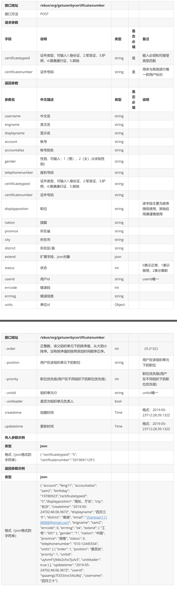
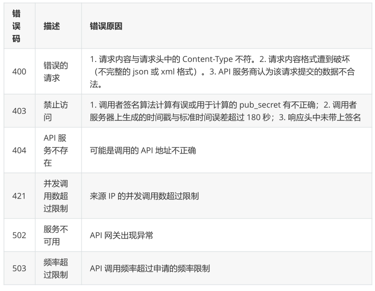

# Api文档

## 1、管理方式

### 1.1	swagger-api

#### 1.1.1	swagger-api定义

> - Swagger是一个简单但功能强大的API表达工具。它具有地球上最大的API工具生态系统，数以千计的开发人员，使用几乎所有的现代编程语言，都在支持和使用Swagger。使用Swagger生成API，我们可以得到交互式文档，自动生成代码的SDK以及API的发现特性等

#### 1.1.2	swagger-api启动

> 1. 安装node-js
> 2. 安装http-server：npm install -g http-server
> 3. git clone https://github.com/swagger-api/swagger-ui.git
> 4. 运行http-server命令
> 5. 进入http://127.0.0.1:8080/dist/index.html就可以看到swagger页面了

## 2、api示例：

### 2.1、用户

> 1. 功能描述
>
>    > 添加一个客户
>
> 2. 请求说明
>
>    > ```python
>    > 请求方式：POST  
>    > 请求URL：/api/mgr/customers
>    > 协议版本：HTTP/1.1
>    > 请求类型：application/json
>    > ```
>
> 3. 请求参数
>
>    > | 字段          | 字段类型      | 字段说明                                     |
>    > | ------------- | ------------- | -------------------------------------------- |
>    > | `action`      | string        | 字段固定填写，`add_customer`表示添加一个客户 |
>    > | `name`        | string(2-20)  | 医院地址                                     |
>    > | `phonenumber` | string(8-15)  | 手机号码                                     |
>    > | `address`     | string(2-100) | 医院地址                                     |
>    >
>    > ```python
>    > // 示例
>    > {
>    >     "action":"add_customer",
>    >     "data":{
>    >         "name":"武汉市桥西医院",
>    >         "phonenumber":"13345679934",
>    >         "address":"武汉市桥西医院北路"
>    >     }
>    > }
>    > ```
>
> 4. 响应消息说明
>
>    > ```python
>    > 版本协议：HTTP/1.1
>    > 状态码：200 OK
>    > 响应类型：application/json
>    > ```
>
> 5. 响应内容
>
>    > ```python
>    > // 成功
>    > {
>    >     "ret": 0,
>    >     "id" : 677
>    > }
>    > 
>    > // 失败
>    > {
>    >     "ret": 1,    
>    >     "msg": "客户名已经存在"
>    > }
>    > ```
>
> 6. 返回参数
>
>    > | 字段  | 字段类型 | 字段说明                   |
>    > | ----- | -------- | -------------------------- |
>    > | `ret` | int      | 0 表示成功,不为 0 表示失败 |
>    > | `id`  | int      | 添加客户的id号             |
>    > | `msg` | string   | 描述添加失败的原因         |

### 2.2、通过用户的证件号码获取用户信息

> 

## 3、常见错误状态码

> 