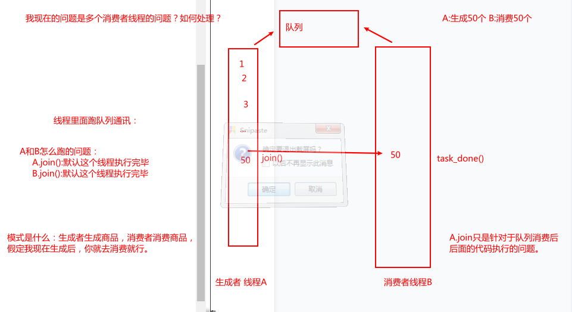

# Python高阶编程

## 1	虚拟环境

### 1.1	安装虚拟环境

```python
# pip install -i 国内镜像地址 包名 清华的源 https://pypi.tuna.tsinghua.edu.cn/simple
pip install virtualenv 
pip install virtualenvwrapper-win # 上面两个是老式的虚拟环境管理包
pip install pipenv # 这个是更加高级的虚拟环境管理包
```

### 1.2	virtualenv的使用命令

```python
# 虚拟环境的一些命令，参考网址:https://www.cnblogs.com/reaptem/p/13890122.html
workon # 列出所有的虚拟环境
workon [name] # 进入指定的虚拟环境
deactivate # 退出当前的虚拟环境
mkvirtualenv [name] # 创建虚拟环境，创建的虚拟环境默认在C:\Users\Administrator\Envs，WORKON_HOME,变量值：“你自定义的路径”。使用lsvirtualenv即可看到虚拟环境路径已经切换为你自定义的路径。（可能需要退出当前命令窗口再重新打开一个窗口才会生效）
rmvirtualenv [name] # 删除虚拟环境
# 包安装 虚拟环境中安装对应的依赖包，进入虚拟环境直接使用pip install 进行安装
pip freeze >requirements.txt
# requirements.txt记录了当前程序的所有依赖包及版本号，起作用是用来在另一个环境上重新构建项目所需的运行环境依赖
pip install -r requirements.txt
```

### 1.3	pipenv管理模块和包

```python
# 在虚拟环境中安装模块或者包，pipenv install包名（注意点在当前项目路径下执行以上命令）
# 通过 --dev指明只安装在开发环境中（开发环境是你当前开发的环境，生产环境是上线部署的实际环境）
pipenv install --dev requests
# 安装包记录是在[dev-packages]部分，或是[packages]部分
# 在安装是，指定--dev参数，则只安装[dev-packages]下的包，若安装时不指定--dev参数，只会安装[packages]包下面的模块

# 卸载虚拟环境的模块包
pipenv uninstall 包名
# 查看安装包及依赖关系
pipenv graph
# 生成requirements.txt文件
pipenv lock -r --dev > requirements.txt
# 通过requirements.txt文件安装环境
pipenv install -r requirements.txt
```

### 1.4	pipenv相关使用命令

```c
// 在项目路径下使用，安装虚拟环境
pipenv install

//卸载当前虚拟环境
pipenv --rm

//在虚拟环境下安装需要的包
pipenv install [package]

//在虚拟环境下删除包
pipenv uninstall [package]

//查看创建的虚拟环境所在目录，pycharm配置环境时用到
pipenv --venv

//查看包对应的依赖关系
pipenv graph

//退出虚拟环境
exit

//列出本地工程目录
pipenv --where

//列出虚拟环境的Python可执行文件
pipenv --py

//生成lock文件，默认会生成lock文件
pipenv lock

//激活虚拟环境
pipenv --shell
```

## 2	python 代码规范

```Python
# pep8(python代码样式规范):https://www.jianshu.com/p/e132bea1d2c9
# pep257(python代码样式规范)
# pep20(python代码样式规范)
```

## 3	python工程结构介绍

```python
readme: 对项目的整体介绍，同时也是一份使用手册，需要时常维护更新,通常为readme.rst/readme.md
license: 阐述该项目的许可说明和授权
setup.py: 通过setup把核心代码打包发布
sample: 存放项目的核心代码
requirements.txt： 存放改项目所有依赖的第三方库
docs: 包的参考文档
tests: 所有的代码测试都存归于该目录
makefile: 用于项目的命令管理（开源项目广泛使用）
根据项目需求添加其他的文件和目录
```

## 4	数据类型

```python
# 性能分析
# 从时间上分析：集合，字典，元组，列表
# 占用内容分析：字典，集合，列表，元祖
```

### 4.1	元组和列表

```python
# 计算创建元祖和列表所需的时间：ipython中使用timeit
import timeit
timeit.timeit

# 命名元祖，作用是像字典一样键值取值
# 构造一个namedtuple需要两个参数，分别是tuple的名字和其中域的名字
student_info = namedtuple('info_tuple',['name','age','gender'])
tu = student_indo('mingming','18','nan')
print(tu.name)
```

### 4.2	字典和集合

```python
se = set() # 空集合
set1 = {1,2,3,4,5,6,7,8,9}
print(set1)

# 集合添加数据，集合是不可变的
se.add('mingming')
se.update{111,222,333,444} # 等同于列表的extend
se.remove('mingming')
se.clear()
se.copy()
print(se)

dic = {} # 空字典，字典的存储原理是hash散列，冲突的话形成链表，为了减少散列冲突，字典的散列表自动扩容
print(type(dict))
# 可变和不可变：不可hash 可hash ,可变类型不可hash，字典是可变对象

# 使用字典推导式将下面字符串的数据，改成字典类型的数据
cook_str = 'biduosid=0291309139189234842342;pstm=12123u131231'
dict_str = {i.split('=')[0]:i.split('=')[i] for i in cook_str.split(';')}
```

### 4.3	推导式

```python
# 列表推导式
urls = ['page{}'.format(i) for i in rang(1,100)]
print(urls)

# 字典推导式
dic = {i:i+1 for i in rang(10)}
print(dic)
```

### 4.4	迭代器和生成器

```python
# 当前文件case.xlsx，设计程序将excel中的用例读取到一个生成器
# excel用例的文件模式
# case_id api_name method url request_data expected_data  比对类型 提取表达式
def read_excel(file_path, sheet_name):
  wb = loadbook(file_path)
  ws = wb[sheet_name]
  row = ws.max_column+1
  col = ws.max_row+1
  for row in rang(2, row_max+1):
    row_dict = {}
    for col in rang(1, column_max+1):
      row_dict[sheet.cell(row=1, column=col).value] = sheet.cell(row=row, col=col)
    yield row_dict
    
# 或者用字典推导式完成
def read_excel(file_path, sheet_name):
  wb = loadbook(file_path)
  ws = wb[sheet_name]
  row = ws.max_column+1
  col = ws.max_row+1
	test_data = (ws.cell(1,j).value:ws.cell(i,j).value for j in rang(1,col) for i in rang(2,row))
  return test_data
res = read.excel('case.xlsx', 'case_datas')
for i in res:
  print(i)
```


```python
# 生成器，在 Python 中，使用了 yield 的函数被称为生成器（generator）。
tu = (i for i in rang(10)) # 生成器对象
a = next(tu)
print(a)
print(next(tu))

# 通过yield自定义生成器
def gen_fun():
  yield 100 # yield的理解，就是return，然后下次next的话从yield下一行语句执行
  print('hello python')
  yield 1000

res = gen_fun() # 返回生成器对象
print(next(res))
print(next(res))

# 列表，可迭代对象，可通过for循环遍历的都是可迭代对象，内部只实现了__iter__方法
li = [1,2,3,4]
li1 = iter(li)
# 迭代器，内部实现了__iter__方法之外，还实现了__next__.生成器是迭代器的一种
print(next(li1))

# 迭代器和生成器的区别，通过生成器生成对象需要一条就取一条，内存上远比字典，列表，字符串，元祖占用内容少的多得多。
# 生成器属于迭代器的一种，如何区分迭代器和生成器？
# 1.生成器相比迭代器多了三种方法:send(),close(),throw()
send(): # 发送数据,与生成器进行交互。yield后的值接收到send发送的值
close(): # 关闭生成器，直接把生成器给关闭了
throw(异常类型，异常提醒信息); # 主动引发生成器的异常，
```

## 5	函数进阶

### 5.1	递归函数

```python
# 递归的临界点很重要，到了临界点就不递归了，常1，0
# 斐波那契数列=前两个数相加
# 递归函数一定要写终止条件，否则将产生无限迭代（死循环）

# 兔子题
def fun2(n):
  if n==1 or n==2:
    return 1
  else:
    return (fun2(n-2)+fun2(n-1))
```

### 5.2	纯函数

```python
# 纯函数的概念：一个函数的返回结果只依赖于它的参数，并且在执行过程里面没有副作用，我们就把这个函数叫做纯函数
# 纯函数的三个原则
# 1.变量都只在函数作用域内获取，作为函数的参数传入
# 2.不会产生副作用（side effects）不会改变被传入的数据或者其他数据（全局变量）
# 3.相同的输入保证相同的输出

# 函数的副作用：副作用是指函数被调用，完成了函数既定的计算任务，但同时因为访问了外部数据，尤其是因为对外部数据进行了写操作，从而一定程度地改变了系统变量

# 常用的内置函数
# map函数：会根据提供的函数对指定序列做映射，返回函数的结果
def fun(n):
  return n<10
li = [1,2,3,4,5,6,7,8,9,0,10]
res = map(fun,li)
print(res)
# filter函数：函数用于过滤序列，返回函数的参数,第一参数是函数，第二参数是可迭代对象
def fun(n):
  return n<10
li = [1,2,3,4,5,6,7,8,9,0,10]
res = filter(fun,li)
print(res)
# zip函数：函数用于将可迭代的对象作为参数，将对象中对应的元素打包成一个原则
```

### 5.3	匿名函数

```python
# python中有一种特俗的函数，不需要使用def去定义，也不用给函数起名字，用过lamda表达式来定义，这种函数叫匿名函数
# 匿名函数格式
lambda 参数：表达式 （返回值）
# 问题需求，将一下函数改成匿名函数
def fun(var):
  return var=2
# 改
lambda var:var=2
# 匿名函数定义后可以直接调用
res = map((lambda a,b:a+b),(1,2))或者(lambda a,b:a+b)(1,2)直接调用

li = [1,2,3,4,5,6,7,8,9,0,10]
res = filter(lambda x:x<10,li)
```

### 5.4	偏函数

```python
# 偏函数定义：python的内置函数functools提供了很多有用的功能，其中一个就是偏函数（partial）
# 偏函数有什么用？
# 当函数的参数个数太多，需要简化时，使用funtools.partial可以创建一个新的函数，这个新函数可以固定住原函数的部分参数，从而在调用时更简单。

# 偏函数的应用
# 在我们之前学到的内置函数中filter中，调用的时候需要传入两个参数，第一个是函数，第二个是我们需要过滤的可迭代类型的数据

# 我们可以通过传入不同的过滤条件去过滤出来我们需要的数据
filter(lambda x:x>3,li1)
filter(lambda x:x>10,li1)
# 要获取数据中大于5的数据
def filter1(iter):
  return filter(lambda x:x>5,iter)

# 上面的filer1函数，减少调用参数的次数，就可以使用过到偏函数了
# from functools import partial
# 偏函数创建一个新函数，提前传入原函数所需要的的参数，让我们在代用的时候更简单
filter2 = partial(filter, lambda x:x>5)
print(list[filter2(li)])
```

### 5.5	闭包

```python
def fun():
  print('---fun被调用')
  num =100
  def count_book():
    print(num)
    print('这个是计算买书方式的函数')
  return coot_book

# 闭包条件
# 1.函数中嵌套函数
# 2.外层函数返回内层嵌套的函数名
# 3.内层嵌套函数有引用外层的一个非全局变量
```

### 5.6	装饰器

```python
# 讲装饰器之前我们先来了解一下开放封闭原则（面向对象原则的核心）
# 开放封闭原则：软件实体应该是可拓展，而不可修改的，也就是说，对拓展是开放的，而对修改是封闭的
# 装饰器的作用：在不更改原有功能函数的内部代理，并且不改变调用方法的情况下未原函数添加新的功能

# 装饰器的应用场景
# 1.登录验证
# 2.函数运行时间统计
# 3.执行函数之前做的准备工作
# 4.执行函数后清理功能

# 多个装饰器装饰的原则
@login_check
@wrapper
def fun():
  time.sleep(3)
  print('这是需要被装饰的函数')
# 装饰器的原则是从下往上装饰，从上往下执行，即先执行@login_check再执行@wrapper
fun()
```

#### 5.6.1	实现一个装饰器

> 1. 装饰器本质上是一个 Python 函数或类，它可以让其他函数或类在不需要做任何代码修改的前提下增加额外功能，装饰器的返回值也是一个函数/类对象。它经常用于有切面需求的场景，比如：插入日志、性能测试、事务处理、缓存、权限校验等场景，装饰器是解决这类问题的绝佳设计。
> 2. 装饰器在 Python 使用如此方便都要归因于 Python 的函数能像普通的对象一样能作为参数传递给其他函数，可以被赋值给其他变量，可以作为返回值，可以被定义在另外一个函数内。
> 3. 参考网址：https://zhuanlan.zhihu.com/p/24900548

```python
def add(func):
  def fun(a,b):
    print('相乘',a*b)
    print('相除',a/b)
    func(a,b)
  return fun

@add
def add_num(a,b):
  print('输入的两个数相加的和为{}:'.format(a+b))
  
add_num(11,22)
```

#### 5.6.2	有参数的装饰器

```python
# 加*的是为了脱衣服
# 1、当*参数出现在函数定义时，表示可变参数
# 2、当*参数出现在函数调用时，则表示解包功能
my_tuple = ("wang","yuan","wai")

temp(*my_tuple)
#---等同于---#
temp("wangyuan","yuan","wai")
my_dict = {"name":"wangyuanwai","age":32}
 
temp(**my_dict)
#----等同于----#
temp(name="wangyuanwai",age=32)

def fun1(*args):
  print(args)
tu = (1,2,3,4)
fun1(tu)
```

#### 5.6.3	通用装饰器

```python
def add(func):
  def fun(*args,**kwargs):
    print(‘装饰器的功能代码：登录’)
    func(*args,**kwargs) 
  return fun
@add  
def index():
  print('这个是网站的首页')
@add  
def goods_list(num):
  print('这个是商品列表第{}页'.format(num))
```

#### 5.6.4	类装饰器

```python
# 使用类装饰器主要依靠类的__call__方法，当使用 @ 形式将装饰器附加到函数上时，就会调用此方法。只调用就可以了
# 使用类装饰器主要依靠__init__方法，进行参数的传递，包括函数名
class Decorator:
  def __init__(self,func):
    self.func = func
    
  def __call__(self,*args,**kwargs):
    print('这个是装饰器里面的功能')
    self.func()
    
@Decorator    
def test_01():
  print('---原来的功能---')
test_01()
```

#### 5.6.5	装饰器装饰类

```python
def add(func):
  def fun(*args,**kwargs):
    print(‘装饰器的功能代码：登录’)
    return func(*args,**kwargs) # 装饰器装饰类的话加上return,否则类得到的结果为空
  return fun

@add  
class myclass: 	
  def __init__(self):
    pass
  
m = myclass()	# myclass()不加括号，实例化的话就是个方法名，add下的fun方法
print('m的值',m)
```

#### 5.6.6	内置装饰器

```python
	# python的类里面中还有三个内置的装饰器
# classmethod: 标识类方法的
class Myclass(object):
  def func1(self): # 普通实例方法
    print('这是func1-------')
  @classmethod  # 被classmethod装饰了之后，改方法就是一个类方法，可以实例.方法名或者类.方法名进行调用
  def func2(cls): # 这个是类方法，cls代表类方法，self代表实例本身
    print('这是func2------')
# staticmethod: 静态方法，实例和类都可以进行调用
  @staticmethod
  def fun3():
    print('这是fun3------')
# property: 作用是将类里面的一个方法当做属性来使用
  @property		# 属性方法，设置的是只读属性
  def fun4(self): # 这个方法可以像属性一样被访问
    print('这是fun4------')
```

#### 5.6.7	应用-函数运行时间装饰器

```python
def wrapper(func):
    """
    实现函数运行时间装饰器
    :param func:
    :return:
    """

    def count_time(*args, **kwargs):
        start_time = time.time()
        func(*args, **kwargs)
        end_time = time.time()
        print('函数运行的时间为：{}'.format(end_time-start_time))
    return count_time
```

#### 5.6.8	应用-登录校验装饰器

```python
# user.txt中的内容{'user':'mingming', 'pwd':'123456', 'token':False}

with open('../test_virtualenv/user.txt','r',encoding='utf-8') as f:
    users = eval(f.read())  # eval函数就是实现list、dict、tuple与str之间的转化。
    print(type(users))


def login_check(func):

    def ado():
        if not users['token']:   # 判断token是否为存在,不存在则进行下面的处理,任何表达式，任何非零、或非空(null)的值均为true
            print('---登录页面---')
            username = input('账号:')
            password = input('密码:')
            # 登录校验
            if users['user'] == username and users['pwd'] == password:
                users['token'] = True
                func()
        else:
            func()
    return ado


@login_check
def index():
    print('这个是登录后的首页')
```

## 6	面向对象之魔术方法

### 6.1	魔术方法

```python
# 地址：https://blog.csdn.net/weixin_39954682/article/details/110894765
# __init__有什么作用：在创建对象的时候，自动调用对创建的对象进行初始化设置的
# 什么是魔术方法：在Python中的__init__这类双下划线开头和结尾的方法，我们把它统称为魔术放阿飞
# 注意点：魔术方法都是python内部定义的，自己不要去定义__init__这种双下划线开头的方法，除非重写覆盖，调用父类的魔术方法
# 创建对象的时候第一个调用的方法是什么：是__new__魔术方法
class myclass(object):  # 在python3中，写不写都是继承object这个基类

	def __init__(self, name): # self代表的是实例本身，将__new__返回的实例注入到self
		self.name = name
		
	def __new__(cls,  *args, **kwargs):
		print('这个是new方法')
		return super().__new__(cls)	# 创建对象的时候第一个调用的方法是__new__()方法，在重写new方法的时候，一定要调用父类的new方法，来完成对象的创建，并且将对象返回出去，cls代表的是类对象本身,实例化对象是Object类底层实现，其他类继承了Object的__new__才能够实现实例化对象。没事别碰这个魔术方法，先触发__new__才会触发__init__,该方法需要返回一个值，如果该值不是cls的实例，则不会调用__init__，该方法永远都是静态方法。
		

m = myclass('mingming')

print(m.name)
```
### 6.2	单例模式

```python
# 需求：类每次实例化的时候都会创建一个新的对象，如果要求类只能被实例化一次改怎么做呢->单例模式，通过重写__new__魔术方法来设置单例模式

# 需求：类每次实例化的时候都会创建一个新的对象，如果要求类只能被实例化一次改怎么做呢->单例模式，通过重写__new__魔术方法来设置单例模式
# 实现方式：
  #	1.定义一个类属性，来记录该类是否创建过对象	
  #	2.在__new__方法中对类属性做判断
  	# 2.1	没有创建过对象，那就创建一个（保存起来），并且修改类属性的值
    # 2.2	创建过了，就将之前创建的返回出去
#	代码实现：实例化一个单例，如果类属性__instance为None，那么就创建一个对象，并且赋值为这个对象的引用，保证下次调用这个方法时能够知道之前已经创建过对象了，这样就保证了只有一个对象
#	单例模式：单例模式类
class Mytest(object):
  instance = None	# 设置一个类属性用来记录这个类有没有创建过这个对象
  
  def __new__(cls, *args, **kwargs):
    if not cls.instance:
      cls.instance = object.__new__(cls)
      return cls.instance
    else:
      return cls.instance
    

t1 = Mytest()
t1.name = 'mingming'
t2 = Mytest()
print(t2.name)
t3 = Mytest()
print(id(t1))
print(id(t2))


# 通过装饰器装饰类来实现单例模式，只要任意一个类使用该装饰器装饰，那么就会变成一个单例模式的类


def single(func):
    instance = {}

    def fun(*args, **kwargs):
        if func in instance:
            return instance[func]
        else:
            instance[func] = func(*args, **kwargs)
            return instance[func]
    return fun


@single
class Mytest():
    pass
```
### 6.3	__str__方法和__repr__方法
```python
#	str(obj)，print(obj)，format(obj)触发的是__str__方法，__str__方法没有定义时触发__repr__方法，如果都没有，回去找父类的__str__方法，repr(obj)和>>>obj触发的是__repr__方法，自身没有__repr__方法时，会去找父类__repr__方法,__repr__方返回对象的描述信息，针对开发者，返回信息保留有原始性
# 代码示例
class Test(object):

    def __init__(self, name):
        self.name = name

    def __str__(self):
        return '触发了str方法'

    def __repr__(self):
        return '触发了repr方法'
```
### 6.4	__call__方法
```python
# 问题：在python中万物皆对象，函数也是对象，为什么函数可以调用，而对象不行？
#  __call__()。该方法的功能类似于在类中重载 () 运算符，使得类实例对象可以像调用普通函数那样，以“对象名()”的形式使用。
```
### 6.5	上下文管理器

```python
# 问题思考：with打开文件为何会自动关闭
# 上下文管理器的概念：上下文管理器是一个python对象，为操作提供了额外的上下文信息，这种额外的信息，在使用with语句初始化上下文，以及完成with块中的所有代码时，采用可调用的形式。
# object.__enter__(self):输入与此对象相关的运行时上下文，如果存在的话，with语句将绑定该方法的返回值到该语句的as子句中指定的目标
# object.__exit__(self, exc_type, exc_val, exc_tb)
	# exc_type: 异常类型
	# exc_val:异常值
	# exc_tb:异常回溯追踪
# 退出与此对象相关的运行时上下文，参数描述导致上下文退出的异常，知道该上下文退出时没有异常，三个参数都将为None，如果提供了一个异常，并且该方法希望抑制该异常（即防止它被传播），它应该返回一个真值，否则，在退出此方法后，异常将被正常处理，注意__exit__()方法不应该重新输出传递进去的异常，这是调用者的责任。

# 代码示例：
class MyOpen():
    """
    文件操作的上下文管理器类
    """

    def __init__(self, file_name, open_method, encoding='utf-8'):
        self.file_name = file_name
        self.open_method = open_method
        self.encoding = encoding

    def __enter__(self):
        self.f = open(self.file_name, self.open_method, encoding=self.encoding)
        return self.f

    def __exit__(self, exc_type, exc_val, exc_tb):
        self.f.close()


file_name = r'C:\Users\Administrator\Desktop\python_advanced\test_virtualenv\user.txt'
with MyOpen(file_name, 'r', encoding='utf-8') as f:
    print(f.read())
    
    
# 示例2
import pymysql

class Db:
    """
    实现一个操作mysql的上下文管理器（可以自动断开连接）
    """

    def __init__(self, data_conf):
        self.con = pymysql.connect(**data_conf)
        self.cursor = self.con.cursor()

    def __enter__(self):
        return self.cursor

    def __exit__(self, exc_type, exc_val, exc_tb):
        self.cursor.close()
        self.con.close()


Database_conf = dict(
    host = '42.192.36.90',
    user = 'mingming',
    password = '1231123131231',
    database = 'nextcloud',
    port = 3306,
    charset = 'utf8')

with Db(Database_conf) as cur:
    cur.execute('select * from oc_file_locks')
    print(cur.fetchone())
```
### 6.6	算数运算的实现
```python
class MyStr():
    """
    算数运算的实现
    """

    def __init__(self, data):
        self.data = data

    def __str__(self):
        return self.data

    def __add__(self, other):
        return self.data+other.data

    def __sub__(self, other):
        return  self.data.replace(other.data, '')


s1 = MyStr('mingming')
s2 = MyStr('min')
print(s1)
print(s2)
s3 = MyStr(s1+s2)
s4 = MyStr(s1-s2)
print(s3)
print(s4)
```
### 6.7	其他魔术方法

#### 6.7.1	__dict__

```python
# 类的静态函数、类函数、普通函数、全局变量以及一些内置的属性都是放在类__dict__里的类的__dict__属性和类对象的__dict__属性由此可见， 类的静态函数、类函数、普通函数、全局变量以及一些内置的属性都是放在类__dict__里的，而对象的__dict__中存储了一些self.xxx的一些东西,即实例相关的属性和方法。
```
###  6.8	作业

## 7	面向对象之多态

### 7.1	面向对象三大特征
```python
# 封装：将数据和方法放在一个类中就构成了封装
# 继承：python中一个类可以继承于一个类也可以继承多个类，被继承的类叫父类（或者叫基类，base class）,被继承的类叫子类
# 多态（Polymorphism）:指的是一类事物有多种形态，一个抽象类有多个子类（因而多态的概念依赖于继承），不同的子类对象调用相同的方法，产生不同的执行结果，多态可以增加代码的灵活度
```
### 7.2	多态
```python
# 实现多态的步骤：
	# 1.定义一个父类（base），实现某个方法（比如run）
	# 2.定义多个子类，在子类中重写父类的方法（run），每个子类run方法实现不同的功能
	# 3.假设我们定义了一个函数，需要一个base类型的对象的参数，那么调用函数的时候，传入base类不同子类对象，那么这个函数就会执行不同的功能，这就是多态的体现
	# 4.多态的意义：
		# 4.1 对于一个变量，我们只需要知道它是Base类型，无需确切地知道它的子类型，就可以放心地调用run()方法，（调用方只管调用，不管细节）
		# 4.2	当需要新增功能，只需要新增一个Base的子类实现run()方法，就可以在原来的基础上进行功能扩展，这就是著名的开放封闭原则
		# 4.3	对扩展开放：允许新增Base子类
		# 4.4	对封闭修改：不想允许修改依赖Base类型的run()等函数：
class Animal():
    """
    这是动物
    """

    def run(self):
        print('共同特性：都会动')


class Cat(Animal):
    """
        这是猫
    """
    def run(self):
        print('这个是猫')


class Dog(Animal):
    """
        这是狗
    """
    def run(self):
        print('这个是狗')


class Test():
    def __init__(self, Animal):
        if isinstance(Animal(), Animal):
            print('{}'.format(Animal.__doc__))


A = Test(Cat)
```
### 7.3	鸭子模型

## 8	面向对象之数据和自省
### 8.1	私有属性
```python
# 1.私有属性：类里面定义的变量叫类属性，那么类属性有两种，分为：共有属性和私有属性
	# 1.私有属性定义：
		# 单下划线开头：_attr
		# 双下划线开头：__attr # 在外部不能直接访问，被改名了，改成了_类名__attr
		
```
### 8.2	内置属性__dict__

```python
# 内置属性：__slots__
	# 1.默认情况下，类的实例有一个字典用于存储属性，这对于具有很少实例变量的对象会浪费空间。当创建大量实例时，控件消耗可能会变得尖锐。
	# 2.Python是动态语言，对于普通的类，可以为类实例赋值任何属性，这些属性会存储在__dict__中，但数据通过字典(Hash)存储所占用的空间较大，效率较低，__slots__属性的出现就是为了解决上述问题。__slots__属性的作用是声明并限定类成员，并拒绝类创建__dict__和__weakref__属性以节约内存空间。
	# 3.使用__slots__要注意，__slots__定义的属性仅对当前类实例起作用，对继承的子类是不起作用的，即子类是会继承父类的__slots__属性的，但是值不会继承
	
	# 描述__slots__属性的作用，并修改读取excel类汇总保存用例的类
# 1. 限制对象属性，指定slots的属性
# 2. 节约内存

class Case:
    __slots__ = ['case_id', 'title', 'url', 'data', 'excepted']

    def __init__(self):
        self.case_id = None
        self.title = None
        self.url = None
        self.data = None
        self.excepted = None
```
### 8.3	自定义属性访问

```python
class Test:
    """
    自定义属性访问，包含属性的增，删，查
    """

    def __init__(self):
        self.age = 18

    def __getattr__(self, item):
        # 当我们访问属性的时候，如果属性不存在（出现attrerror），该方法会被触发。
        print('---这个是getattr---')
        return super().__getattr__(item)

    def __getattribute__(self, item):
        # 访问属性的时候，第一时间触发该方法去找属性
        return super().__getattribute__(item)

    def __setattr__(self, key, value):
        # 这个方法在给兑现设置属性的时候触发
        if key == 'age':
            super().__setattr__(key, 18)
        else:
            print('新增属性的时候回触发这个方法')
            super().__setattr__(key, value)

    def __delattr__(self, item):
        # 这个方法在删除属性的时候会被触发
        if item == 'age':
            pass
        else:
            print('删除新增的属性被调用')
            super().__delattr__(item)
```
### 8.4	描述器

```python
class NameProperty(object):
    """
    一个类中，只要出现以下三个方法的任何一个，那么该类就被成为描述器类
    参数介绍：
        self指代当前类的实例，调用者,即描述器类
        instance是个实例，是owner的实例，调用的类的实例对象
        owner是属性的所属的类，即调用的类
    """

    def __init__(self):
        self._name = ''

    def __get__(self, instance, owner):
        print("Getting {}".format(self._name))
        print(instance, owner)

        return self._name

    def __set__(self, instance, name):
        print("Setting {}".format(name))
        if not isinstance(name, str):
            raise TypeError("name must be a string, but got {}".format(type(name)))
        self._name = name.title()

    def __del__(self, instance):
        print("Deleteing {}".format(self._name))
        del self._name


class Person(object):
    name = NameProperty()
    age = 23
```

### 8.5	ORM模型介绍

```python
# ORM模型介绍：O为类和对象；R为关系，关系数据库中的表格；M为映射。即把ORM的类，对象，属性映射为数据库中的数据表，数据行，字段
# ORM框架的功能：1.建立模型类和表之间的对应关系，允许我们通过面向对象的方式来操作数据库 2.根据设计的模型类生成数据库的表格	3.通过方便的配置就可以进行数据库的切换
# 数据库的字段类型：1.整数:int，bit	2.小数：decimal(decimal表示浮点数，如decimal(5,2)表示共存5位数，小数占2位)	3.字符串：varchar,char(char不可变长度，vachar可变长度)	4.日期时间：date,time,datetime	5.枚举类型（enum）
# ORM模型中对应的字段（下面为django的ORM模型中选取的几个字段）	1.BooleanFied布尔字段，值为True或False	2.CharField(max_length=最大长度)字符串，参数max_length表示最大字符个数	3.IntegerField整数
# 模型类案例
class TestReport(BaseTable):
	class Meta:
		verbose_name = '测试报告'
		db_table = 'TestReports'
	
	report_name = models.CharField(max_length=40, null=False)
	start_at = models.CharField(max_length=40, null=True)
	status = models.BooleanField()
	testsRun = models.IntegerField()
	successes = models.IntegerField()
	reports = models.TextField()
	
	# CharFiled自定义
class CharFiled:

    def __init__(self, max_length):
        self.max_length = max_length

    def __get__(self, instance, owner):
        return self.value

    def __set__(self, instance, value):
        if isinstance(value, str):
            if len(value) <= self.max_length:
                self.value = value
            else:
                raise ValueError('字符串长度应该在{}以内'.format(self.max_length))
        else:
            raise TypeError('need a str')

    def __delete__(self, instance):
        self.value = None

# 模型类
class UserModel(object):
    name = CharFiled(max_length=3)
    pwd = CharFiled(max_length=40)


m = UserModel()
m.name = '999'
print(m.name)
```

## 9	面向对象之元类

### 9.1	旧式类VS新式类
```python
# 元类：元类比99%的用户所忧虑的东西具有更深的魔法。如果你犹豫考虑是否需要它们，那么实质上你不会需要它们（实际需要它们的人确信它们确实需要，并且不需要进行任何解释）-蒂姆-彼得斯
# 1.旧式类VS新式类：在Python范畴，一个类可以是两种类型之一。官方术语并没有对此进行区分，所以它们被非正式地称为旧式类和新式类
# 旧式类：类(class)和类型（type）并不完全相同。一个旧式类的实例总是继承来自一个名为instance的内置类型，如果obj是旧式类的实例，那么obj.class就表示该类，但type（obj）始终是instance类型。
# 新式类：新式类统一类（class）和类型（type）的概念，如果obj是新式类的实例，type（obj）则与obj.class相同，注意：在python2中，默认所有类都是旧式类，在python2.2之前，根本不支持新式类，从python2.2开始，可以创建新式类，但必须明确声明它为新式类。在python3中，所有类都是新式类，因此，python3可以交换一个引用对象的类和类型。
class MyClass:
	# 经典类
	pass
class Test(object):
	# 新式类
	pass
```
### 9.2	类型（Type）和类（Class）
```python
# type:python3中所有的类都是通过type来创建出来的：元类
# object:python3中多有的类的顶级父类都是object
```
### 9.3	使用type动态定类
```python
# 内置type()函数在传递一个参数时将返回一个对象的类型，对于新式类，通常与对象的class属性相同
# type(name, bases,dict)调用type()：参数name指定类名称，将成为该类的name属性；bases指定继承类的基类元组，将成为该类的bases属性；dict指定包含类主体定义的名称控件字典，将成为该类的dit属性。
# 
# python中内置的元类type，空元组（），元祖中只要一个元素（obj，）
Test = type('Test', (object,), {'attr': 100, "__attr2": 200}这里也可以类的方法=函数)
# 等价于下面的类定义
class Test(object):
    attr = 100
    __attr2 = 200
```
### 9.4	自定义元类
```python
# 元类就是创建类这种对象的东西，type就是python的内置元类，当然了也可以创建自己的元类
# 自定义元类
# 自定义元类必须要继承于type
# type创建类：三个参数

# 自定义元类
# 自定义元类必须要继承于type
# type创建类：三个参数


class MyMetaClass(type):
    def __new__(cls, name, bases, attr_dict, *args, **kwargs):
        print('最基础的自定义元类')
        # return type.__new__(cls, name, bases, attr_dict)
        return super().__new__(cls, name, bases, attr_dict)


class Test(metaclass=MyMetaClass):
    name = 'mingming'


# 父类指定元类，子类可以继承父类所指定的元类
class MyClass(Test):
    pass


print(type(Test))
print(type(MyClass))
test = Test()
print(test.name)
```
### 9.5	ORM模型的实现思路

```python
# 自定义元类实现orm模型思路，首先定义用户类-用户表，用户表里面只定义对应的字段属性，
# 而用户表继承模型类，模型类里面定义定义属性的init方法和数据库save操作，模型类继承
# 自定义元类，重写__new__方法进行属性的筛选。子类也是继承父类的指定的元类方法


# CharFiled自定义
class CharFiled:

    def __init__(self, max_length):
        self.max_length = max_length

    def __get__(self, instance, owner):
        return self.value

    def __set__(self, instance, value):
        if isinstance(value, str):
            if len(value) <= self.max_length:
                self.value = value
            else:
                raise ValueError('字符串长度应该在{}以内'.format(self.max_length))
        else:
            raise TypeError('need a str')

    def __delete__(self, instance):
        self.value = None


# 利用元类实现模型类
class ModelMetaClass(type):

    def __new__(cls, name, bases, dic, *args, **kwargs):
        if name == 'Model':
            return super().__new__(cls, name, bases, dic)
        else:
            table_name = name.lower()   # 将类名转化为小写，对应数据表的名称
            fields = {}  # 定义一个空字典，用来存在模型类字段和数据表中字段对应的关系
            for k, v in dic.items():  # 遍历所有的属性
                if isinstance(v, CharFiled):
                    fields[k] = v
            dic['t_name'] = table_name
            dic['fields'] = fields
            return super().__new__(cls, name, bases, dic)


class Model(metaclass=ModelMetaClass):
    def __init__(self, **kwargs):
        print('模型类传入的参数为{}'.format(kwargs))
        for k, v in kwargs.items():
            setattr(self, k, v)


    def save(self):
        # 保存一条数据，生成一条对应的sql语句
        # 获取表名
        t_name = self.t_name
        # 获取字段名称
        fields = self.fields
        filed_dict = {}
        # 获取对应字段的值
        for filed in fields.keys():
            filed_dict[filed] = getattr(self, filed)
        # 生成对应的sql语句
        sql = 'insert into {} value{};'.format(t_name, tuple(filed_dict.values()))
        print(sql)


# 用户模型类,对应的是表
class User(Model):
    username = CharFiled(max_length=10)
    pwd = CharFiled(max_length=10)


if __name__ == '__main__':
    # 实现以下用户模型类表
    user = User()
    user.username = 'mingming'
    user.pwd = '123456'
    user.save()
    user = User(username='mingming', pwd='123123')
    user.save()
```

## 10	内存管理

### 10.1	对象引用

#### 10.1.1	引用计数

#### 10.1.2	内置函数is和id

```python
# 1. 我们要查看两个变量是不是引用的是同一个对象，这个时候我们有两种方法，查看变量的Id(指向的内存地址)是否一样的，通过is判断是否为同一个对象
```

#### 10.1.3	数据的可变性

```python
# python的基本数据类型中可变类型为：list,dict,set 不可变类型为：数值类型，字符串，元祖，如何区分数据的可变还是不可变，我们可以通过ID来确定数据的唯一性。
# 可变对象和不可变对象：可变对象是指，一个对象再不改变其所指向的地址的前提下，可以修改其所指向的地址中的值；不可变对象是指，一个对象所指向的地址上值是不能修改的，如果你修改了这个对象的值，那么它指向的地址就改变了，相当于你把这个对象指向的值复制出来一份，然后做了修改后存到另一个地址上了，但是可变对象就不会做这样的动作，而是直接在对象所指的地址上把值给改变了，而这个对象依然指向这个地址。
```

### 10.2	小整数池和intern机制

```python
# 小整数池：-5到256数值的闭区间都是小整数池，大整数池指的是字符串，只存储包含标准字符（数字，字母，下划线）的字符串，包含特俗字符的字符串不会被添加到大整数池中。
```

### 10.3	深浅拷贝

```python
#  深拷贝
import copy


li = [1, 2, 3]
list1 = [11, 22, li]
list4 = copy.deepcopy(list1)

# 浅拷贝


li = [1, 2, 3]
list1 = [11, 22, li]
list3 = list1.copy()

# 区别:在浅拷贝时，拷贝出来的新对象的地址和源对象是不一样的，但是新对象里面的可变元素（如列表）的地址和原对象里的可变元素的地址是相同的，也就是说浅拷贝它拷贝的是浅层次的数据结构（不可变元素），对象里的可变元素作为深层次的数据结构并没有被拷贝到新地址里面去，而是和原对象里的可变元素指向同一个地址，所以在新对象或原对象里对这个可变元素做修改时，两个对象是同时改变的，但是深拷贝不会这样，这个是浅拷贝相对有深拷贝最根本的却别。
```

###  10.4	垃圾回收和GC模块

#### 10.4.1	垃圾回收机制

```python
# python中的垃圾回收机制用一句话来形容就是：引用计数机制为主，标记-清除和分代收集两种机制为辅的策略。标记-清除和分带收集都是辅助引用计数的垃圾回收的进行。

# 引用计数原理：每个对象维护一个ob_ref，用来记录当前对象被引用的次数，也就是来追踪到底有多少引用指向了这个对象
# 引用计数+1的情况：1.对象被创建 a = 14 2.对象被引用 b =  a 3.对象被作为参数传到函数中 func(a) 4.对象作为一个元素，存在容器中 list = {a,b,c,d 
# 引用计数-1的情况：1.当该对象的别名被显示销毁时 del a 2.当该对象的引用别名被赋予新的对象 a = 26 3.一个对象离开他的作用域，例如func函数执行完毕时，函数里面的局部变量的引用计数器就会减一（但是全局变量不会） 4.将该元素从容器中删除是，或者容器被销毁时
# 当指向该对象的内存的引用计数器为0的时候，改内存将会被Python虚拟机销毁
# 引用计数法的优缺点：
优点： 1.高效 2.运行期没有停顿可以类比一下Ruby的垃圾回收机制，也就是实时性：一旦没有引用，内存就直接释放了。不用像其他机制等到特定实际，实时性还带来一个好处：处理内存的时间分摊到了平时 3.对象有确定的生命周期 4.易于实现
缺点： 1.维护引用计数消耗资源，维护引用计数的次数和引用赋值成正比，而不像mark and sweep等基本与回收的内存数量有关  2.无法解决循环引用的问题，A和B相互引用而再没有外部引用A与B的任何一个，它们的应用计数都为1，但显示应该被回收。


# 标记-清除法
标记清除算法是一种基于追踪回收计数实现的垃圾回收算法，它分为两个阶段：第一阶段是标记阶段，GC会把所有的的活动对象打上标记，第二个阶段是把哪些没有标记的对象非活动对象进行回收，从根对象出发，沿着有向边进行遍历，可达的对象标记为活动对象，不可达的对象就是要被清楚的非活动对象，根对象就是全局变量，调用栈，寄存器。标记清楚算法作为Python的辅助垃圾收集计数主要处理的是一些容器独享，比如list dict tuple instance等，因为对于字符串，数值对象是不可能造成循环引用问题。


# 分代回收
分代回收是一种以空间换时间的操作方式，Python将内存根据对象的存活时间划分为不同的集合，每个集合称为一个代，Python将内存分为3代，分别是年轻代（第0代），中年代（第1代），老年代（第2代）他们对应的是3个链表，他们的垃圾收集频率与对象的存活时间的增大而减小。新创建的对象都会分配在年轻代，年轻代链表的总数达到上限时，Python垃圾收集机制就会被触发，把哪些可以被回收的对象回收掉，而那些不会回收的对象就会被移到中年代去，依次类推，老年代中对象是存活时间最久的对象，甚至是存活于整个系统的什么周期内。同时，分代回收是建立在标记清除技术基础之上，分代回收同样作为Python的辅助垃圾收集技术处理那些容器对象。

# 分代回收由来：而在垃圾回收的过程中，其实在进行垃圾回收之前还要进行一步垃圾检测，即检查某个对象是不是垃圾，该不该被回收。当对象很多，垃圾检测将耗费大量的时间而真的垃圾回收花不了多久。对于这种多对象程序，我们可以把一些进行垃圾回收频率相近的对象称为“同一代”的对象。垃圾检测的时候可以对频率较高的“代”多检测几次，反之，进行垃圾回收频率较低的“代”可以少检测几次。这样就可以提高垃圾回收的效率了。至于如何判断一个对象属于什么代，python中采取的方法是通过其生存时间来判断。如果在好几次垃圾检测中，该变量都是reachable的话，那就说明这个变量越不是垃圾，就要把这个变量往高的代移动，要减少对其进行垃圾检测的频率。
	分代回收策略着眼于提升垃圾回收的效率。研究表明，任何语言，任何环境的编程中，对于变量在内存中的创建/销毁，总有频繁和不那么频繁的，比如任何程序汇总总有生命周期是全局的，部分的变量，而在垃圾回收的过程中，其实在进行垃圾回收之前还要进行一步垃圾检测，即检查某个对象是不是垃圾，该不该被回收，当对象很多，垃圾检测将耗费大量的时间而真的垃圾回收花不了多久，对于这种对象程序，我们可以把一些进行垃圾回收频率相近的对象称为同一代的对象，垃圾检测的时候可以对平路较高的代多检测几次，反之，进行垃圾回收频率较低的代可以少检测几次，这样就可以提交垃圾回收的效率了，至于如何判断一个对象属于什么代，python中采取的方法是通过其生存时间来判断的。如果在好几次垃圾检测中，该变量都是reachable的话，那就说明这个变量越不是垃圾，就要把这个变量往高的代移动，要减少对其进行垃圾检测的频率。
```

#### 10.4.2	Gc模块

```python
# 为什么需要gc模块
对于循环引用的情况，一般的自动垃圾回收方式肯定是无效了，这时候就需要显示的调用一些操作来保证垃圾的回收和内存不泄露，这就要用到python内建的垃圾回收模块gc模块了。

# gc模块的方法
gc.collect() # 显示的可以进行垃圾回收
gc.get.threshold()：这个方法返回的是（700，10，10），这也是gc的默认值，这个值的意思是说，在第0待对象数量达到700个之前，不把未被回收的对象放入第一代，而在第一代对象数量达到10个之前也不把未被回收的对象移到第二代，可以使用gc.set.threshold(threashold0,threashold1,threashold2)来手动设置这组阀值。
```

## 11	并发和性能

### 11.1	并发和并行

```python
# 1. 多任务
# 2. 并发
并发：指的是任务数多余cpu核数，通过操作系统的各种任务调度算法，实现用多个任务一起执行（实际上总有一些任务不再执行，因为切换任务的速度相当快，看上去一起执行而已）
# 3. 并行
并行：指的是任务数小于等于cpu核数，即任务真的是一起执行的
# 4. cpu与多任务的关系
单核cpu可不可以执行多任务？也可以执行多任务，由于cpu执行代码都是顺序执行的，那么，单核cpu是怎么执行多任务的呢？答案就是操作系统轮流让各个任务交替执行，任务1执行0.01秒，切换到任务2，任务2执行0.01秒切换到任务3，执行0.01秒...这样反复执行下去，表面上看，每个任务都是交替执行的，但是，由于cpu的执行速度太快了，我们感觉就像所有的任务都在同时执行一样。
# 5.同步和异步
同步：是指线程在访问某一资源时，获得了资源的返回结果之后才会执行其他操作（先做某件事，再做某件事）
异步：与同步相对，是指线程在访问某一资源时，无论是否取得返回结果，都进行下一步操作；当有了资源返回结果时，系统自动通知线程。
举个例子：点外卖的例子，外卖到不到的结果是否影响你做下一件事，如果影响则是用不，不影响则是异步。
# 总结
真正的并行执行多任务只能在多核cpu上实现，但是，由于任务数量远远多于cpu的核心数量，所以，操作系统也会自动把多任务轮流调度到每个和核心上执行。
并发：指的是任务数多于cpu核数，通过操作系统的各种任务调度算法，实现用多个任务一起执行（实际上总有一些任务不在执行，因为切换任务的速度相当快，看上去一起执行而已）
并行：指的是任务数小于等于cpu核数，即任务真的是一起执行的。
```

### 11.2	线程

#### 11.2.1	threading模块介绍
```python
# python的thread模块是比较底层的模块，python的threading模块是对thread做了一些包装的，可以更加方便的被使用，利用threading.Thread（）来创建Thread对象。
创建线程：threading.Thread(target = func)
# 参数target指定线程执行的任务（函数）
Thread类提供了以下方法：
run():同以表示线程活动的方法
start():启动线程活动
join([time]):设置主线程会等待time秒后再往下执行，time默认为子线程结束，多个线程之间设置的值会叠加
isAlive():返回线程是否活动的
getName():返回线程名
setName():设置线程名
threading.currentThread():返回当前执行的线程
threading.enumerate():返回正在执行的所有线程（list），正在运行指线程启动后，结束前，不包括启动前和终止后的线程
threading.activeCount():返回正在运行的线程数量
threading.current_thread().name：每一个 Thread 都有一个 name 的属性，代表的就是线程的名字，这个可以在构造方法中赋值。如果在构造方法中没有个 name 赋值的话，默认就是 “Thread-N” 的形式，N 是数字。否则在创建Thread对象时，构造方法里面赋值线程名（name属性赋值）。

# Thread的生命周期
1. 创建对象时，代表Thread内部被初始化
2. 调用start()方法后，thread会开始运行
3. thread代码正常运行结束或者是遇到异常，线程会终止


# 创建Thread对象有两种手段：1.直接创建Thread，将一个callable对象从类的构造器传递进去，这个callable就是回调函数，用来处理任务 2.编写一个自定义继承Thread，然后复写run()方法，在run()方法中编写任务处理代码，然后创建这个Thread的子类。
# 直接创建Thread:
threading.Thread(group=None, target=None, name=None, args=(), kwargs={}, *, daemon=None)

# 编写一个自定义继承Thread
备注：传参数则需要重写__init__方法（注意重写之后要调用父类的init方法）
import threading
import requests
import time


class RequestThread(threading.Thread):
    def __init__(self, url):
        self.url = url
        super().__init__()


    def run(self):
        for i in range(10):
            res = requests.get(self.url)
            print('线程：{}---返回的状态码---{}'.format(threading.current_thread().name, res.status_code))


# 创建五个线程，发起请求
s_time = time.time()
for i in range(5):
    t = RequestThread('https://www.baidu.com/')
    t.start()
    t.join()
e_time = time.time()
print('耗时:', e_time-s_time)
```
#### 11.2.2	多线程实现多任务

#### 11.2.3	多线程-共享全局变量
```python
# 总结：
1. 在一个进程内的所有线程共享全局变量，很方便在多个线程共享数据
2. 缺点就是，线程是对全局变量随意更改可能造成多线程之间对全局变量的混乱（即线程非安全）
# 锁的好处
1. 确保了某段关键代码只能由一个线程从头到尾完整地执行
# 锁的坏处
1. 阻止了多线程并发执行，包含锁的某段代码实际上只能以单线程模式执行，效率就大大地下降了
2. 由于可以存在多个锁，不同线程持有不同的锁，并试图获取对方持有的锁时，可能会造成死锁
# 如果多个线程同时对同一个全局变量操作，会出现资源竞争问题，从而数据结果会不正确
```

#### 11.2.4	同步&互斥锁
```python

# 同步
同步就是协同步调，按预定的先后次序进行运行，‘同’字从字面上容易理解为一起动作，其实不是，‘同’字应该是指协同，协助，互相配合，如进程，线程同步，可理解为进行或线程A和B一起配合，A执行到一定程度时要依靠B的某个结果，于是停下来，示意B运行，B执行，再讲结果给A，A在继续操作。

# 互斥锁
1. 线程同步能够保证多个线程安全访问竞争资源，最简单的同步机制是引入互斥锁
2. 互斥锁为资源引入一个状态：锁定/非锁定
3. 某个线程要更改共享数据是，先将其锁定，此时资源的状态为锁定，其他线程不能更改知道该线程释放资源，将资源的状态变成‘非锁定‘，其他的线程才能再次锁定改资源
4. 互斥锁保证了每次只有一个线程进行写入操作，从而保证了多线程情况下数据的正确性

# threading模块中定义了Lock类，可以方便的处理锁定：
# 创建锁
mutex = threading.Lock()
# 锁定
mutex.acquire()
# 释放
mutex.release()
# 注意：如果这个锁之前是没有上锁的，那么acquire不会堵塞
# 上锁解锁过程：当一个线程调用所得acquire()方法获得锁时，锁就进入locked状态，每次只有一个线程可以获得锁，如果此时另一个线程试图获得这个锁，该线程就会变成blocked状态，称为阻塞，直到拥有锁的线程调用锁的release()方法释放锁之后，锁进入unlocked状态；线程调度从处于同步阻塞状态的线程中选择一个来获得锁，并使得该线程进入运行running状态
```

#### 11.2.5	死锁
```python
def fun1():
    global a
    for i in range(1000):
        meta_A.acquire()
        meta_B.acquire()
        print('---1---')
        a += 1
        meta_B.release()
        meta_A.release()
    print('线程1修改a:', a)


def fun2():
    global a
    for i in range(1000):
        meta_B.acquire()
        meta_A.acquire()
        print('---1---')
        a += 1
        meta_A.release()
        meta_B.release()
    print('线程2修改a:', a)


```

#### 11.2.6	队列
```python
# Python的Queue模块中提供了同步的，线程安全的队列类，包括：
1. FIFO(先入先出)队列Queue 
from queue import Queue
2. LIFO(后入先出）队列LifeQueue 
from queue import LifoQueue
3. 优先级队列PriorityQueue
from queue import PriorityQueue
# 队列中的元素为元祖类型：（优先级， 数据），优先级填写的数值越小，优先级越高

# 这些队列都实现了锁原语，能够在多线程中直接使用，可以使用队列来实现线程间的同步。
# 初始化Queue()对象时（例如：q = Queue()）,若括号中没有指定最大可接收的消息数量，或数量为负值，那么就代表可接收的消息数量没有上限。
# 队列的方法：
task_done(self)
join(self)
qsize(self)
empty(self)
full(self)
put(self, item, block=True, timeout=None)
get(self, block=True, timeout=None)
put_nowait(self, item)
get_nowait(self)
Queue.qsize():返回当前队列包含的消息数量
Queue.empty():如果队列为空，返回True,反之False
Queue.full():如果队列满了，返回True,反之False
Queue.get():获取队列，timeout等待时间
Queue.put(item)：写入队列
Queue.get_nowait():相当于Queue.get(False)
Queue.put_nowait(item):相当于Queue.put(ietm, False)
Queue.task_done()：在完成一项工作后，使用Queue.task.done()方法可以向队列发送一个信号，表示该任务执行完毕
Queue.join()实际上意味着等到队列中所有的任务（数据）执行完毕之后，再往下，否则，一直等待，只有消费者把队列所有的数据处理完毕，queue.join()才会停止阻塞
注意点：join()是判断的依据，不单单指的是队列中没有数据，数据get出去之后，要使用task.done()向队列发送一个信号，表示该任务执行（数据使用）完毕，所以Queue.join()一般和Queue.task_done()配合使用。
```

#### 11.2.7	GIL全局解释器（拓展）
```python
# 历史原因：python语言和GIL没有半毛钱关系，仅仅是由于历史原因在Cpython虚拟机（解释器），难以移除GIL
# GIL：全局解释器锁，每个线程在执行的过程都需要先获取GIL,保证同意时刻只有一个线程可以执行代码，正是GIL锁的存在，才致使线程不能实现并行，只能并发。
```
#### 11.2.8	生产者消费者模式实现




```python
# 为什么要使用生成这和消费者模式？
在线程世界里，生成者就是生产数据的线程，消费者就是消费数据的线程，在多线程开发当中，如果生成者处理速度很快，而消费者处理能力很慢，那么生产者就必须等待消费者处理完，才能继续生成数据，同样的道理，如果消费者的处理能力大于生成者，那么消费者就必须等待生成者，为了解决这个问题引入了生产者和消费者模式。
# 什么是生产者消费者模式？
生产者消费者模式是通过一个容器来解决生产者和消费者的强耦合问题，生产者和消费者不直接通讯，而通过阻塞队列来进行通讯，所以生产者生产完数据之后不用等待消费者处理，直接扔给阻塞队列，消费者不找生产者要数据，而是直接从阻塞队列中取，阻塞队列就相当于一个缓冲区，平衡了生成者和消费者的处理能力。

"""
1. 用一个队列来存储商品
2. 创建一个专门生产商品的线程类，当商品数量少于50时，开始生产商品，每次生产200个
3. 创建一个转梦消费商品的线程类，当商品数量大于10时就开始消费，循环消费，每次消费3个
4. 创建一个线程生产商品，5个线程消费商品
"""


import time
from queue import Queue
from threading import Thread


# 创建一个队列
q = Queue()


# 队列里面存储商品


# 生产者和消费者模式
class Product(Thread):
    """生产者"""
    def run(self):
        count = 0
        # 判断队列中的商品数是否少于50时，如是少于50则每次生产200个
        while q.qsize() < 50:
            for i in range(200):
                count += 1
                goods = '---第{}个商品---'.format(count)
                q.put(goods)
                print('生产：', goods)
            print(q.qsize())
            q.join()
        print('生成者生成的商品已经全部消费完毕！')


class Consumer(Thread):
    """消费者,当商品数量大于10时就开始消费，循环消费，每次消费3个"""
    def run(self):
        print('消费者接受到的队列长度：{}'.format(q.qsize()))
        while q.qsize() > 0:
            print('消费：{}'.format(q.get()))
            q.task_done()
            time.sleep(0.01)
        time.sleep(1)


if __name__ == '__main__':
    p = Product()
    c = Consumer()
    p.start()
    time.sleep(1)
    c.start()
```

### 11.3	进程
#### 11.3.1	进程介绍
```python
# 什么是进程？
答：它是操作系统分配和调度系统资源（cpu,内存）的基本单元。进程之间是相互独立的，每启动一个新的进程就相当于把数据进行了一次克隆，子进程里的数据修改无法影响到主进程中的数据，不同子进程之间的数据也不能直接共享，这是多进程在使用中与多线程最明显的区别。
# 进程的状态有哪些？
答：就绪状态：运行的条件都已经满足了，正在等待cpu执行；执行状态：cpu正在执行其功能；等待状态：等待某些条件满足，例如一个程序sleep了，此时就处于等待状态。
```
#### 11.3.2	进程、线程对比
```python
# 定义的不同
1. 进程是系统进行资源分配和调度的一个独立单位
2. 线程是进程的一个实例，是CPU调度和分配的基本单位，它是比进程更小的能独立运行的基本单位，线程自己基本上不拥有系统资源，只拥有一点在运行中必不可少的资源（如程序计数器，一组寄存器和栈）但是它可与用属一个进程的其他的线程共享进程所拥有的全部资源
# 区别
1. 一个程序至少有一个进程，一个进行至少有一个线程
2. 线程的划分尺度小于进行（资源比进行少），使得多线程程序的并发性高
3. 进行在执行过程中拥有独立的内存单元，而多个线程共享内存，从而极大地提高了程序的运行效率
4. 线程不能够独立执行，必须依存于进程中
5. 可以将进程理解为工厂中的一条流水线，而其中的线程就是这个流水线上的工人
# 优缺点
1. 线程和进行在使用上个有优缺点：线程执行开销小，但不利于资源的管理和保护；而进行相反。
```
#### 11.3.3	multiprocessing模块
```python
# multiprocessing模块
# Process([group[,name[,args[,kwargs]]]]);常用的实例pw = Process(target = write,args = (q,))
target:子进程要执行的函数
args:给target指定的函数传递的参数，以元祖的方式传递
kwargs:给target指定的函数传递命名参数
name:给进程设定一个名字，可以不设定
group:指定进程组，大多数情况下用不到
# Process创建的实例对象的常用方法
start():启动子进程实例（创建子进程）
is_alive():判断进程子进程是否还在活着
join([timeout]):是否等待子进程执行结束，或等待多少秒
terminate():不管任务是否完成，立即终止子进程
# Process创建的实例对象的常用属性
name:当前进程的别名，默认为Process-N，N为从1开始递增的整数
pid:当前进程的pid(进程号)
```
#### 11.3.4	进程间通信-Queue
```python
# Python multiprocessing.Queue()和queue.Queue区别
1. queue.Queue是进程内阻塞队列
2. multiprocessing.Queue是跨进程通讯队列
3. Process之间有时需要通信，操作系统提供了狠毒哦机智来实现进程间的通信
```
#### 11.3.5	进程池Pool
```python
# 进程池Pool引入的额原因
答:当需要创建的子进程不多时，可以直接利用multiprocessing中的Process动态生成多个进程，但如果是成百上千个目标，手动的去创建进程的工作量巨大，此时就可以用到multiprocessing模块提供的Pool方法
# 进程池Pool运行的原理？
答：初始化Pool时，可以制定一个最大进程数，当有新的请求提交到Pool时，如果池还没有满，那么就会创建一个新的进程进程用来执行该请求；但如果池中的进程数已经达到了指定的最大值，那么该请求就会等待，知道池中有进程结束，才会用之前的进程来执行新的任务。
# Pool常用方法？
1. apply_async(func[,args[,kwargs]]):使用非阻塞方式调用func(并行执行，阻塞方式必须等待上一个进程退出才能执行下一个进程),args为传递给func的参数列表,kwargs为传递给func的关键字参数列表;补充：阻塞式的运行执行一个进程，apply(func[,args[,kwargs]]),作用是：添加一个任务执行一个任务，如果一个任务不结束另一个任务就进不来。
2. close():关闭Pool，使其不再接受新的任务
3. terminate():不管任务是否完成，立即终止
4. join():主进程阻塞，等待子进程的退出，必须在close或terminate之后使用
# 进程池代码的使用范例
from multiprocessing import Pool
import os, time, random


def work(msg):
    t_start = time.time()
    print('%s开始执行，进程号为%d' % (msg, os.getpid()))
    #  random.random()随机生成0-1之间的浮点数
    time.sleep(random.random() * 2)
    t_stop = time.time()
    print(msg, '执行完毕，耗时%0.2f' % (t_stop - t_start))


if __name__ == '__main__':
    po = Pool(3)
    for i in range(0, 10):
        # 每次循环将会用空闲出来的子进程去调用目标，即开启一个子进程去执行任务
        po.apply_async(work, (i,))

    print('---start---')
    po.close()  # 关闭进程池，关闭后po不再接收新的请求
    po.join()
    print('---end---')
```
#### 11.3.6	进程池中的Queue
```python
# 进程池中的队列怎么使用？
答：如果要使用Pool创建进程，就需要使用multiprocessing.Manager()中的Queue()，而不是multiprocessing.Queue()，如果multiprocessing模块的Queue与Pool创建的进程同时使用的话，会报下列的错误：
RuntimeError:Queue objects should only be shared between processes through inheritance.

# 方式1：通过multiprocessing().Queue()来实现
from multiprocessing import Queue
from multiprocessing import Process


list = ['lipeng', '王五', '赵四']


def write(q):
    for temp in list:
        print('---%s write to queue'%temp)
        q.put(temp)


def read(q):
    while True:
        if not q.empty():
            value = q.get()
            print('---get %s from queue' % value)
        else:
            print('queue is empty')
            break


if __name__ == '__main__':
    q = Queue()
    pw = Process(target=write, args=(q,))
    pr = Process(target=read, args=(q,))
    pw.start()
    pr.start()
    pw.join()
    pr.join()


# 方式2：通过进程池的队列multiprocessing().Manager()来实现
from multiprocessing import Manager, Pool
import os,time,random


def reader(q):
    print('reader启动(%s),父进程为(%s)'%(os.getpid(), os.getppid()))
    for i in range(q.qsize()):
        print('reader从Queue获取到消息：%s'%q.get(True))


def writer(q):
    print('writer启动(%s),父进程为(%s)' % (os.getpid(), os.getppid()))
    for i in range(5):
        q.put(i)


if __name__ == '__main__':
    print('(%s) start' % os.getppid())
    q = Manager().Queue()
    po = Pool()
    po.apply(writer, (q,))
    po.apply(reader, (q,))
    po.close()
    po.join()
    print('(%s) end' % os.getppid())
    
# 进程池通讯例子
from multiprocessing import Manager, Pool
import time, os


a = 0


def reader(q):
    print('reader启动(%s),父进程为(%s)' % (os.getpid(), os.getppid()))
    # for i in range(q.qsize()):
    while q.qsize() > 0:
        time.sleep(0.01)
        print('reader从Queue获取到消息：%s' % q.get())
        global a
        a += 1
    print('进程{}执行了{}次'.format(os.getpid(), a))


# def writer(q):
#     print('writer启动(%s),父进程为(%s)' % (os.getpid(), os.getppid()))
#     for i in range(50):
#         q.put(i)


if __name__ == '__main__':
    print('主进程(%s) start' % os.getppid())
    q = Manager().Queue()
    po = Pool(3)
    for i in range(100):
        q.put(i)
    time.sleep(2)
    for i in range(3):
        po.apply_async(reader, args=(q,))
    po.close()
    po.join()
    print('主进程(%s) end' % os.getppid())
    
```
### 11.4	协程
```python
# 什么是协程
1. 协程是python中另外一种实现多任务的方式，只不过比线程更小占用执行单元（理解为需要的资源），为啥说它是一个执行单元，因为它自带CPU上下文，这样只要在合适gr的时机，我们可以把一个协程切换到用另一个协程，只要这个过程中保存或恢复CPU上下文那么程序还是可以运行的
2. 通俗的理解：在一个线程中的某个函数，我们在任何地方保存当前函数的一些临时变量等信息，然后切换到另外一个函数中执行，注意不是通过调用函数的方式做到的，并且切换的处室以及什么时候再切换到原来的函数都由开发者自己确定
# 协程和线程差异
1. 在实现多任务时，线程切换从系统层面远不止保存和恢复CPU上下文这么简单，操作系统为了程序运行的高效性每个线程都有自己缓存Cache等等数据，操作系统还会帮你做这些数据的恢复操作，所以线程的切换比较消耗性能，但是协程的切换只是单纯的操作CPU的上下文，所以一秒钟切换上百次系统都扛得住。
# greenlet
1. 为了更好使用协程来完成多任务，python中的greenlet模块对其封装，从而使得切换任务变的更加简单。
安装：pip install greenlet
2. 例子，手动切换挂起g1.switch()协程件进行切换操作。
from greenlet import greenlet
import time


def test1():
    for i in range(10):
        print(i)
        g2.switch()
        time.sleep(0.1)


def test2():
    for i in range(10):
        print(i)
        g1.switch()
        time.sleep(0.1)


g1 = greenlet(test1)
g2 = greenlet(test2)
g1.switch()
# gevent
当一个greenlet遇到IO操作时，比如访问网络/睡眠等待，就自动切换到其他的greenlet，等到IO操作完成，再在适当的时候切换回来继续执行。由于IO操作非常耗时，经常使程序处于等待状态，有了gevent为我们自动切换协程，就保证总有greenlet在运行，而不是等待IO。同时也因为只有一个线程在执行，会极大的减少上下文切换的成本。
1. 协程存在于线程之中，线程默认不会等待协程执行
2. spawn:开启协程（第一个参数为协程要执行的任务）
3. join:让线程等待协程执行
4. sleep:协程之间切换的条件
5. monkey.patch_all:gevent的程序补丁，打补丁的作用：只要有耗时的地方（大部分），自动切换任务，不局限于gevent.sleep()
例子：
import gevent
from gevent import monkey
import time
# monkey.patch_all()配合协程阻塞这种时间等待的


def test1():
    for i in range(10):
        print('协程一正在执行任务打印%d' % i)
        gevent.sleep(0.5)


def test2():
    for i in range(10):
        print('协程二正在执行任务打印%d' % i)
        gevent.sleep(0.5)


g1 = gevent.spawn(test1)
g2 = gevent.spawn(test2)
g1.join()
g2.join()
```
### 11.5	进程，线程，协程对比
```python
# 各自队列的区别
1. from multiprocessing import Queue(可以用于多进程，但不能用于进程池)
2. from multiprocessing import Manger(可以用于进程Pool创建的进程池)
# 总结
1. 进程是资源分配的单位
2. 线程是系统调度的单位
3. 进程切换需要的资源最大，效率很低
4. 线程切换需要的资源一般，效率一般（当然了在不考虑GIL的情况下）
5. 协程切换任务资源很小，效率高
6. 多进程，多线程根据cpu核数不一样可能是并行的，但是协程是在一个线程中，所以是并发
7. python中的线程由于GIL锁的存在，并不能实现并行
```