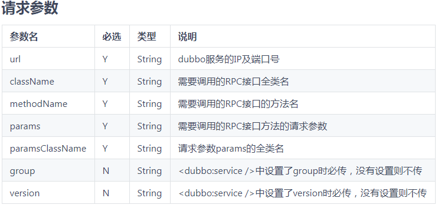

# RPC接口测试

## 1、什么是rpc协议

> 1. 什么是 RPC 框架
>
>    > ```shell
>    > # 1.RPC是指远程过程调用，也就是说两台服务器A，B，一个应用部署在A服务器上，想要调用B服务器上应用提供的函数/方法，由于不在一个内存空间，不能直接调用，需要通过网络来表达调用的语义和传达调用的数据
>    > ```
>
> 2. 需要解决的5个问题
>
>    > ```shell
>    > # 第一，首先，要解决通讯的问题，主要是通过在客户端和服务器之间建立TCP连接（socket），远程过程调用的所有交换的数据都在这个连接里传输。连接可以是按需连接，调用结束后就断掉，也可以是长连接，多个远程过程调用共享同一个连接。
>    > 
>    > # 第二，要解决寻址的问题，也就是说，A服务器上的应用怎么告诉底层的RPC框架，如何连接到B服务器（如主机或IP地址）以及特定的端口，方法的名称名称是什么，这样才能完成调用。比如基于Web服务协议栈的RPC，就要提供一个endpoint URI，或者是从UDDI服务上查找。如果是RMI调用的话，还需要一个RMI Registry来注册服务的地址。
>    > 
>    > # 第三，当A服务器上的应用发起远程过程调用时，方法的参数需要通过底层的网络协议如TCP传递到B服务器，由于网络协议是基于二进制的，内存中的参数的值要序列化成二进制的形式，也就是序列化（Serialize）或编组（marshal），通过寻址和传输将序列化的二进制发送给B服务器。
>    > 
>    > # 第四，B服务器收到请求后，需要对参数进行反序列化（序列化的逆操作），恢复为内存中的表达方式，然后找到对应的方法（寻址的一部分）进行本地调用，然后得到返回值。
>    > 
>    > # 第五，返回值还要发送回服务器A上的应用，也要经过序列化的方式发送，服务器A接到后，再反序列化，恢复为内存中的表达方式，交给A服务器上的应用
>    > ```
>
> 3. 总结
>
>    > ```shell
>    > # 1，远程服务之间建立通讯协议
>    > 
>    > # 2，寻址：服务器（如主机或IP地址）以及特定的端口，方法的名称名称是什么
>    > 
>    > # 3，通过序列化和反序列化进行数据传递
>    > 
>    > # 4，将传递过来的数据通过java反射原理定位接口方法和参数
>    > 
>    > # 5，暴露服务：用map将寻址的信息暴露给远方服务（提供一个endpoint URI或者一个前端展示页面）
>    > 
>    > # 6，多线程并发请求业务
>    > ```
>
> 4. 已有的rpc框架要解决的问题和解决的思路
>
>    > ```shell
>    > # 1. 解决分布式系统中，服务之间的调用问题。
>    > 
>    > # 2. 远程调用时，要能够像本地调用一样方便，让调用者感知不到远程调用的逻辑。
>    > 
>    > # 3. rpc 是什么？就是socket 加动态代理。
>    > ```

## 2、rpc接口测试

> ```shell
> # 1.接口测试主要分HTTP和RPC两类，RPC类型里面以Dubbo较为知名。
> # 2.互联网微服务架构，两种接口都需要做接口测试的，不管是业务测试还是回归测试；
> 
> # 3.Dubbo：Java栈的互联网公司比如阿里、美团、58、滴滴、京东等等都是差不多的服务端架构，所以这些公司，两类接口测试也是必不可少的工作部分；
> 
> # 4.Dubbo是一个分布式服务框架，致力于提供高性能和透明化的RPC远程服务调用方案，以及SOA服务治理方案。简单的说，dubbo就是个服务框架，如果没有分布式的需求，其实是不需要用的，只有在分布式的时候，才有dubbo这样的分布式服务框架的需求，并且本质上是个服务调用的东东，说白了就是个远程服务调用的分布式框架（告别Web Service模式中的WSdl，以服务者与消费者的方式在dubbo上注册）
> ```
>
> 1. rpc api文档示例
>
>    > 接口实体： Object restForRpc(RequestParams requestParams);
>    >
>    > 请求URL： http://10.118.60.177:8931/express/test/restForRpc
>    >
>    > 请求方式：POST
>    >
>    > 
>
> 2. 

